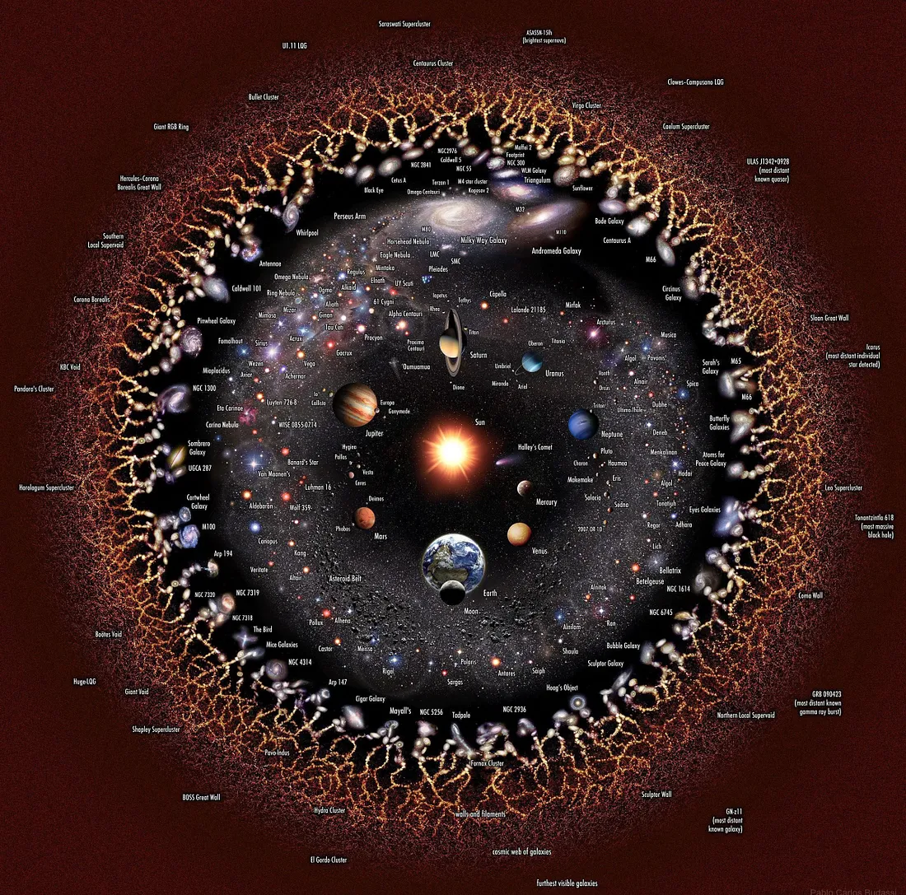

<iframe width="100%" height="500" src="https://www.youtube.com/embed/CrLm7SiGU8U?si=1vuFaPMBpWdvqlUO" title="YouTube video player" frameborder="0" allow="accelerometer; autoplay; clipboard-write; encrypted-media; gyroscope; picture-in-picture; web-share" referrerpolicy="strict-origin-when-cross-origin" allowfullscreen></iframe>

---

<audio controls>
  <source src="https://www.dropbox.com/scl/fi/zzdiy1pbemlajlkrbaqul/the-lyric-voice.mp3?rlkey=f4yheq18wym6pznvb7loxxotc&raw=1" type="audio/mpeg" >
</audio>

> [!quote] ​
> Lyric culture is based on a lyrical approach to Truth, Beauty, the Good, and Wisdom

## Ac-ci-dental

Attempting to disclose disclosure
I am looking for us to have an accident together
Words are the vehicles we use
To drive us over the cliff
To hit the concrete wall
Crash!
Driving us to wordlessness

Disclosure means waiting for an accident together
Seeing for the first time, but
When it’s there you can’t even point to it
Because it’s not there at the same time.
The finger, aimlessly tracing the night sky
Trying to find the moon, but
By some lovely accident
It has breached the earth’s orbit
Looking for a new cosmic accident

Silence is the great enemy of the people
Words are no better
Disclosure comes from a foreign place
Where we used to look for gods
Now there are only aliens
And their jibberish.

Accidents are happening all around us
All of the time
The giant anteater is an accident
His wooly arms and Pinoochio nose are accidents
The way he walks on his knucles is an accident
LOOK! The way she accidentally smiles!

Discloses something about our selves
200 million years before
We were the ones there but not there
At the same time

---

> [!quote] ​
> A lyrical approach involves a shift in reasoning, judgment, posture, gesture and perception; requires a shift in whole-part relations; and does not distinguish philosophy from art, literality from musicality, goodness from beauty.

> [!quote] ​
> Lyric culture promotes intimacy the way
theoretic culture promotes literacy.

> [!quote] ​
> Lyric thought is a direct response to the fact that the particular capacity for language-use possessed by our species cuts us off from the
world in a way, or to a degree, that is painful.

> [!quote] ​
> We experience the burden of our capacity for language as loss— though we rarely recognize that this is the burden, that what we have lost is silence.

> [!quote] ​
> Lyric art is the fullest expression of the hunger for wordlessness.

![[lyric-philosophy-and-culture/the-lyric-voice/presentation]]

## Cohorts

> [!info] Note that access requires a paid membership.

- [Cohort 1](https://bonnittaroy.substack.com/p/video-recording-lyric-voice-cohort)
- [Cohorts 2,3](https://bonnittaroy.substack.com/p/video-recordings-lyric-culture)
- [Cohorts 4,5](https://bonnittaroy.substack.com/p/video-recordings-lyric-culture-cohorts)
- [Cohort 5](https://bonnittaroy.substack.com/p/video-recording-lyric-voice-cohort-160)

## Further Resources

- [Original Content Material](https://bonnittaroy.substack.com/p/the-lyric-voice)
- [Original Content Material(Presentation)](https://bonnittaroy.substack.com/p/video-presentation)
- [[no-view]]

