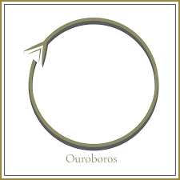

> The stream of James turns out to be a self-referential metaphor\
that is also, and not accidentally, directly accessible to us,\
the most immediate organization of our physical reality.\

– Harry T. Hunt

## Reflection: causal twin-ness

**Retrospective Sensemaking**

There is a simple definition of *reflection* which merely means that after an event we take the time to *reflect on it, *which means to think about it retrospectively. This is an important skill to practice, but it is severely constrained by the simple fact that reflection of this type is *after the fact*. Reflection of this type draws on bits of memories, some of which are more salient than others, while important pieces of the situation may be left out entirely. As we have seen with memory, it is selective, and in service of the present (or future) and gets shaped by what we want to be the case, rather than what was actually the case. We add narrative through imaginary processes, in order to compose a coherent interpretation. Reflection, in this sense as *retrospective sensemaking*, is important part of maintaining both autobiographical coherence as an individual and collective, shared meaning in a group. It is a way to update your sense of things, generating a new starting position, as it were, an updated context from which you or the group can carry on.

**Reflective Being**

> ... where should we look to find our own structures\
> outside ourselves and how do we recognize it?

– Harry T. Hunt

There is a psycho-spiritual sense of *reflection* which says that the subject and the object are *reflections* of each other (the psychological sense) or that reality and self are *reflections* of each other (the spiritual sense). Harry Hunt writes:

> Put in a somewhat different form, our existence has emerged out of the physical universe and most immediately and adjacently out of the niches or "clearing" in some sense "afforded" or "allowed" by the nonlinear media dynamics that surround all living forms. If so, it cannot be intrinsically wrong to look for our reflected "face" and "structure" within the physical systems that at various levels have generated our being.

This is a classic Buddhist "reflection" on the nature of reality. The psychological meaning of this entails the notions of projection and introjection and the common phrase "we don't see the world as it is, but as we are." This, however, is a mis-reading of the deeper truth in Buddhism. While there is a teaching in Buddhism which tells us that our subjective disposition is implicated in the causal outcomes of the concrete world, this also is not quite the core meaning. This is more of a matter of why humans are trapped in self-fulfilling prophecy. No, the question of the "perfect relation" between our intrinsic self and reality, something I call "twin-ness," runs deeper still.

The perfect reflection, is often likened to a mirror, but this proves to be problematic in several ways. Our dualistic minds set it up to be the self that is looking at the mirror, and never nature looking at the mirror and seeing our self. At the end of the day, it boils down to two mirrors reflecting each other. What happens there, is anyone's guess.

Perfect reflection, as twin-ness means something else. The closest thing we come to in the west is the notion of quantum entanglement. What happens to you happens to me at the same time, regardless of where and when we are. We are tied together by one causal umbilicus that can never be cut. It is not a law of equal and opposite, like Newton's laws of motion, or Vervaeke's laws of opponent processing. It is a law of causal interpenetration. I am the cause of you and you are the cause of me, we are the effects of each other. No distance.

When you understand the deeper meaning of causal twin-ness, then you realize you can let go of the problem of projection in the psychological sense. If what I am observing in the world is a perfect reflection of my interiority, then I merely have to pay attention to the things to gauge the state of my self. We develop a great sense of freedom (from self obsession) and clarity. Put your room in order, Peterson says, and it cleans up your soul.

## Recursivity - the snake eating its tail

[The ouroboros is an ancient symbol](https://en.wikipedia.org/wiki/Ouroboros), depicted in early Egypt as a snake eating its own tail. There are hundreds, if not thousands of variations of this symbol, across cultures and time. Here is a simple minimalist abstraction:

Recursivity means something like "start at square one, you always return to square one, despite how much you've tried to distance yourself from it." It is a hallmark of discursive thought, where we begin with a problem, step it up into higher, more complex levels of analysis, in which we get the feeling that we are getting somewhere, only to discover, after a long effort, that our destination is merely a more complex version of the same problem. *Does this sound familiar?*

Infinite regression is a particular kind of recursivity. It often comes up when people are doing awareness practices. First, you notice that "someone is aware," and that comes as an insight. But then you wonder, "who is aware that someone is aware?" and *that *comes as an insight.[^1] In this case, infinite regression occurs because people take the insight to mean that there is someone behind the curtain. This is a subtle reification that we should pay no attention to, *because there is no man behind the curtain*. The experience itself, given in the very first realization *is the insight.* It merely repeats itself as the very same insight in different "meta" versions of itself. The construction remains the same, no matter how meta we go on it. This of course, points to why it is an instance of recursion. No matter how meta we go to escape it, the same insight appears over and over again. Back to square one.

<iframe width="100%" height="500" src="https://www.youtube.com/embed/YWyCCJ6B2WE" title="YouTube video player" frameborder="0" allow="accelerometer; autoplay; clipboard-write; encrypted-media; gyroscope; picture-in-picture; web-share" allowfullscreen></iframe>

### Reflexivity: sense-full- ness/ mindful heeding

There are different meaning of the word "reflexivity" and many of them refer to a kind of boomerang effect, as in reflexivity of the markets in capitalism--- what you put out amplifies what effect it has on you. All the scams in bitcoin and other digital coins leverage the kind of reflexivity there is in our society, and with social media, this kind of reflexivity is on steroids. A major stockholder can dump a bunch of shares in order to drive the prices down, only then to turn around and re-purchase them at lower cost. This is what Elon Musk actually did at Tesla. Alternately, a major investor in a digital bank can drive the prices of the coin up through his purchase power & influence, and then quickly dumping his coins onto buyers who have been fooled by all the hype --- something known as *pump and dump.*

This is not the reflexivity we are talking about. We are talking about reflexivity in the sense of "sense-full ness" and "mindful heeding," which refer to the same dispositional state, but the first phrase emphasizes the bodily aspect, whereas the second phrase (which you see more in the literature) emphasizes the "mind" aspect.

Reflexive awareness begins when one realizes the the mind and the body are intimately coupled. We usually, although perhaps very subtly, think of the mind and body as causally related, such that the body does something that effects the mind (up-ward causation) or that the mind does something that effects the body (down-ward causation). There is some truth to this, depending upon the context in which you are looking at their dynamics. If you look at the neurodynamics, of course, the physiological activities of your body and brain (widely construed) happen in time, and there are causal relationships that take time to get from A to B. But from the view of whole experience, which is a view that comes from opening awareness to the whole of experience, to the gestalt at every moment, we see that the is only one "living tissue" that is happening. We switch from "my legs are moving one after the other" to "I am walking across the room." We switch from parts to whole, from cause-and-effect to whole-process.

Mindful heeding/ sense- full- ness means attending to everything all at once--- bodily sensation, perceptual information, dispositional feeling, mental properties. It means adopting a stance that is balanced such that instead of attention chasing around after one and then the other such there are gaps (perception///gap/// thought/// gap/// feeling/// gap///thought////gap///sensation///gap///...) everything is experienced as a whole gestalt. Attention is broad enough to take in all of it, without losing sight of any of it. This means mindful heeding is a balanced stance *accompanied by a great deal of cognitive scope. *It is a state of non-prioritizing any of the aspects of your living-being. You don't get distracted by any particular "thing" --- which requires assigning them "thingness", freezing them out of the flow of the moment, as if they were stationary, solid things we could inspect. [^2]

## Awareness

This brings us to awareness. Which is not reflective, recursive, infinitely regressive, or mindful, sense full, heeding. How does the notion of "pure awareness" relate to dispositional state, affect, perception, imagination, intuition, and abstraction? And how does it relate to consciousness itself? In the live on-line sessions we will attend to the question of awareness in collective insight practice. You won't want to miss these, as the cap-stone of our background series.

## Further Resources

- [Original Content Material](https://bonnittaroy.substack.com/p/awareness-reflection-recursivity/)
- [The Most Misunderstood Concept in Physics](https://www.youtube.com/watch?v=DxL2HoqLbyA)
- [This is not reflexivity (as we define it). This is recursive reflection. Worth a watch](https://www.youtube.com/watch?v=FZVMB8mrNO0)

> Through all beings spreads the one space:\
> the world's inner space.\
> Silently fly the birds\
> all through us.\
> O I who want to grow\
> I look outside,\
> and it is in me that the tree grows!’\

## Cohort

> [!info] Note that access requires a paid membership.

- [Cohorts 1,2](https://bonnittaroy.substack.com/p/video-links-awareness-cohorts-1-and/)
- [Cohort 3](https://bonnittaroy.substack.com/p/video-recodring-awareness-cohort/)
- [Cohort 4](https://bonnittaroy.substack.com/p/video-recording-awareness-cohort)
- [Cohort 5](https://bonnittaroy.substack.com/p/video-recording-awareness-cohort-836)
- [Cohort 6](https://bonnittaroy.substack.com/p/video-recording-awareness-final-cohort)

[^1]: In my masters course I always began the first session with the Daoist story about the knife:

    *A knife was happy cutting things for a living, until, after a particularly long day of work, he was captured by the question "Who am I?" This came to him as such a profound experience, that he set out to discover the answer. He journeyed around the world. He cut cheese, and realized "I am not cheese." He cut meat and realized "I am not meat." He cut cloth and realized "I am not cloth." *He tried to cut stone, and destroyed all his teeth. In his very old age, he laid down on the rock and despaired. When suddenly he realized "I am that which cuts!" But it was precisely **then** that he was something else.

    The answer is, that precisely when he realizes he is that which cuts, he is now *that which knows it is that which cuts. *Eventually leading to infinite regression.

[^2]: This of course means that we have inserted a subtle loop of retrospective reflection into the fleeting moment, which means, we are lagging behind the present moment.

