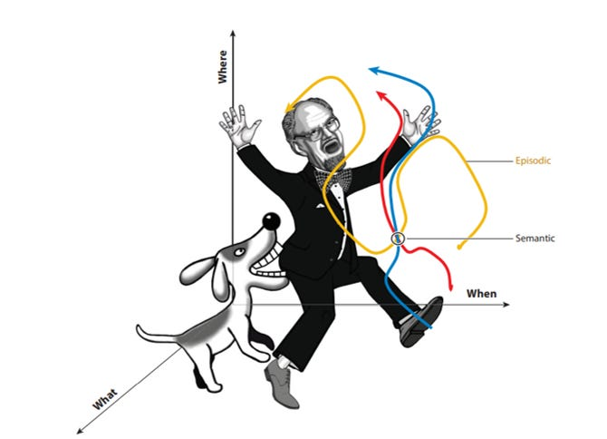
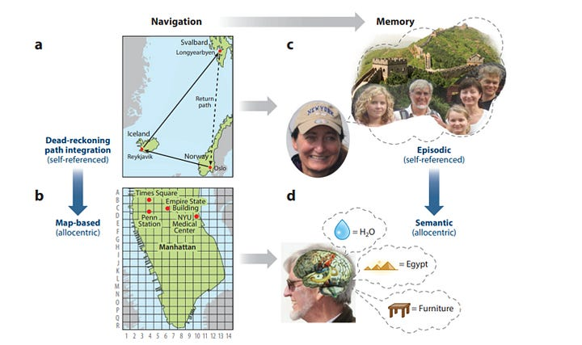

> Human memory is short and terribly fickle.

– Janine di Giovanni

## Ouvre

Perception may be a contested topic, but we know a lot about it, especially about visual perception. Memory, however, is still poorly understood by neuroscientists and cognitive scientists and phenomenologists and contemplative philosophers. One of the major reasons why memory is not well understood, is that it is not a single system operating on its own. Rather, memory is a way that sensation, perception, imagination and action are woven together, what Andy Clark calls a "cognitive package deal."

If you are looking for a "memory" through phenomenological observation, you will only find the "parts" of the assemblage. Memory appropriates sensations, virtual perceptions, internal representations, and story fragments, in order to *assemble a memory*. In this respect it is much more a creative act of the imagination than a retrieval process in the concrete sense of the word. We don't find a memory stored somewhere in a box, file, or hard drive. There is no specific location to retrieve it from, nor discrete code command to retrieve it by.

**The question then becomes "what is the assembling process that constitutes remembering?"** And the answer is actually embedded in the word "re-membering." If we take the word literally, we get a clue to the answer. Think of the sensation, perception, internal representations, and story fragments as "members," and the assemblage as the process of "re-membering" the parts into a whole. Like sensation and perception, memory begins in arousal, and ends in satisfaction --- when the assemblage is remembered into a coherent whole. The significant point, however, is that the whole must be coherent with the *present situation*, not the past. So the goal of remembering is to reach a point of satisfaction by assembling past fragments into a whole that is coherent with the present.[^1]

> That is the tricky task of memory: it must bring up portions of the past that cohere to satisfy a present situation.

The second major point to understand about memory, is that without memory, an organism cannot learn. Learning depends upon comparing the difference or variance (delta) between one moment and the next. If the delta is positive, the action is repeated or advanced. If the delta is negative, there is an error correction. Let me explain. Imagine a single cell animal swimming in a fluid with a sugar gradient (more sugar at one end, less at the other). If it veers off and senses less sugar, it will error correct. If it turns another way and gets a stronger sugar sensation, it will redirect itself in that direction. If it amplifies that too much, it will again error correct. There is no straight line in nature! There are only incremental meanderings between positive and negative sensations.[^2]

> If there were no memory of the prior sensation, the "delta" could not be known and learning could not advance.

Now we know why memory is fickle. It must be robust enough to satisfy the "delta equation" but also flexible enough to satisfy present conditions *as they arise in real time*. [^3] If we could track memory through the "up-hierarchy" of the human body in real time, we might notice it traces an arc, from deeper, more robust processes, "up" toward higher-order, more flexible needs. A metaphor would be like a chef. On the one end of the arc, the chef needs to be able to reliably reproduce your favorite dishes. On the other end of the arc, the chef needs to be flexible enough to cook *what you want today. *In the real human body, along the way, sometimes the recipe and the request get mixed together. We might start with a recipe for pizza, and while we are tossing the dough, get the request for a fruit dish. Hence, the invention of the pineapple pizza! And as humans, we are satisfied more if the dish satisfies the current request (fruit!) than if the dish is reproduced without variation.[^4]

Memory, therefore is a *thread that weaves the past into the present. *It is an unfolding, a growth process, from seed to fruit, setting root in the past, but carrying forward into the present through present moment processes and flows. [^5]

---

**A second question derives from the first: Where do the fragments come from?** There are different kinds of memory, which trace different pathways up the up-hierarchy of human embodied process: episodic, mimetic, theoretic, and enacted.

Given that memory instantiates learning, we can correlate these with different kinds of knowledge:

**Episodic memory - experiential knowing, self-referential events**

A good example of episodic memory is the way a horse studies, remembers and learns. For example, a horse may learn to cross a river at a certain river-crossing. They know this particular crossing well, and go across without any reluctance. However, if you take them to a different river, or another section of the same river, or another season when the river is running differently than usual, the horse has to learn it over again. You see this behavior over and over again with horses, and it makes them seem "stupid" as when they can't find their way out of the paddock because the gate that is open is not the usual gate. It takes them some time to scan the environment and put that together. In other words, the horse does not generalize across difference. However, you can ride along a path that you've ridden a hundred times, and all of a sudden the horse will come to a dead stop and start snorting, and if you look carefully enough, you might see that a familiar road mark --- a small stone or fallen tree on the side of the path--- has been moved away, maybe by a foot or less. Episodic memory is how we remember what it is like to be our self, what it is like to be "me" as the epicenter surrounded by a horizon of events.[^6]

Episodic memory is deeply rooted in sensorial experience, and is highly fine-grained. The difference between episodic memory versus theoretic, metaphorically, is like the difference between a fine silk thread and coarse jute rope. It is a process of *taking in the environment and making it a part of my self.* It is the way we remember the smell of our loved ones, the experience of tasting salt on the wind before a storm by the sea. Exhorting episodic memory is like calling oneself back into a vivid dream.**\
**

**Mimetic memory - procedural knowing, tacit action-focused "know-how"**

Mimetic memory is based in gesture and action. It is experienced as bodily know-how. For example, before smart phones stored all our friends' phone numbers, it was frequently the case that when you could not remember the actual digits of a person's phone number, you would just clear your mind and let your fingers remember it. The action protocol was stored somehow in your fingers, and all "you" had to do is get out of the way (stop thinking). Mimetic memory calls forth action sequences that are reproducible, like learning how to play an entire piano concerto just by the "feel" of it as it unfolds through your hands. Of course, mimetic memory is highly dependent upon affect-laden arousal states that "ping" the procedure with associated feelings. You don't simply allow your fingers to peck at the numbers or piano keys, rather you *prime your state with associative feelings* --- that presence the person or the concerto. Therefore, mimetic memory is coupled with fragments of episodic memory.

**Theoretic memory - propositional knowing, semantic, representational**

Just as mimetic memory is rooted in episodic memory, theoretic memory is rooted in mimetic memory (which in turn is rooted in episodic memory). In this way "remembering" traces an evolutionary history from deeper, evolutionary more recent systems to higher, evolutoinary more recent systems. This is no mere sequence, or tripartition. Rather it is a mutual enfoldment and unfolding flow from core to surface, from feeling to knowing. Theoretic memory is representational, symbolic, and semantic. These too are stored in associative clusters, like abstract categories are organized. For example, when I think of the category "bird" at the center is a representation (image) of something like the outline of a robin, crow, or bluejay. This is the most proximate (or heavily biased, or heavily weighted) representation. Further out there are hummingbirds and toucans, and further still, ostriches and penguins. A platypus or a bat might be floating around at the outskirts, not completely caught in the orbit of the category "bird" but associated with it because of the category "flying." In this sense, semantic clusters are organized like venn diagrams, except the dimensional space is far more than 2D.

---

## A Theory of Ecological Assembly

*Gygory Buzsaki*

In this section I want to highlight that as humans, we store a great deal of what we remember, both individually and collectively, on external things in our environment. We jot down notes. We rely on Google Calendar to handle our schedule. We build digital "second brains," etc.. This is not as trivial as it might seem at first. In the following discussion I will rely on Andy Clark's Theory of Ecological Assembly[^7]

Basically, the theory says that whenever and wherever possible, an organism will off-load memory in ways that lower the energy costs of storing and retrieving. For example, having to remember all of Shakespeare's plays require a great deal of storage "space." But "storage space" in the body means the energy it takes to do continuous maintenance "uphill against the forces of continuous change, decay, and entropy, and that kind of maintenance is energetically expensive.

What about retrieval? Well, the best way to lower the energy cost of retrieving stored memories, is to have a "trigger" or "threshold" event, which when breached, unleashes a cascade of events which fall down an energy gradient. Which means, once the threshold is breached, the sequence of successive events occurs at net zero energy cost. For example, it may take quite a lot of energy to open the floodgates of a dam, but once opened, the water rushes out without having to do any more work.

In terms of bodily stored memory, triggers and thresholds are arousal states, that flow into "virtual perception" space (mental, imagination, simulation) and on the way assemble a memory by following rules of association --- the patterns that connect.

The important thing to note is that memories unfold in time --- again, like a chef putting together a recipe. Some sequences are very strongly "wired" - conditioned or habituated "schemas." Others are open to, vulnerable to being revised along the way, depending upon what is presently more salient. Like a dream unfolding, that incorporates some of the external stimulus into its "script."[^8] It is easier, in terms of energy costs, to follow either a categorical schema, or to just take up present associations, than to faithfully store and precisely recover a memory perfectly.[^9]

This leads to a corollary:

## From Problem to Procedure

A propositional problem will naturally cascade "down" the evolutionary stack (down the up-hierarcy) to mimetic, episodic to participatory actions, to artifacts in the world. For example, I am given a math problem to solve. If I don't remember the answer propositionally, then I will take up a procedure I know, arrange my posture and motivational state (episodic) and take actions to solve it--- working it out pen on paper. Once the answer is worked out, I can simply refer to the piece of paper to extend that memory in the world.

Notice, in this case I did not remember the answer but I remembered the *procedure to get the answer. *For the most part, this is how memory works. What the "procedures" are, are "action protocols", or action sequences that are stored in the body through episodic memory. Let's say I ask you if you still know how to ride a bike. You don't have to pick up a bike and go through the entire procedure. Rather, you can trace through the (episodic) memory of riding a bike and get a reality check.

Of course, the proof is in the pudding. But I think you know what I mean here.

---

## Collective Memory is also Procedural Resourcefulness

Social memory primarily relies on and is based in procedural resourcefulness. For example, we can store all the world's knowledge on the internet, but without the action protocols to 1) use the internet, 2) read the words, 3) understand the instructions, the memory of what is recorded in the text would be completely lost. In turn, procedural memory is reproduced by mimetic processes, such as education and training, and simple miming or copying behavior.

Collective memory is like a beaver pond that remembers that it was once a forest and might one day become forest again; remembers how to become a meadow. At some level all memory is collective in this way--- the aggregate collection of action protocols in the habitas of the individuals, and the affordances in the habitat in which they swim. [See, for example, the work of Michael Levin.](https://youtu.be/-Bwq1oOST7w)

Note: we will talk more about collective memory in the Origins of Culture sessions of this series, later in the fall.

---

## Perception, Prediction & Memory

Most of what we think of as "memory" or "remembering" consists of these stored fragments that can be thought of as "rolling presences." As Clark describes them,

> The past there exists only as it is crystallized into the agent-inaccessible form of altered probability density distribution used to meet and to organize the incoming sensory flow.

In other words, it is a matter of continuously searching for satisfying "matches" between what was known in the past (now represented as remembered fragments) and what is being sensed and perceived in the unfolding of the present experience. At each juncture, when a fragment is a good-enough match, the conscious occasion takes a short cut, passing over much of the details that would otherwise (with different quality of attention) be available, in order to speed up the flow towards the target satisfaction. In familiar situations, where risk and uncertainty are low, most of what is "perceived by the conscious self" are actually just the fragments, newly presented to the mind. With good-enough fragments, the body can take actions that accurately solve an easy problem. As the gap between effort and satisfaction grows, however, attention shifts from cursory observation to more concentrated perceptual activity.

Sometimes, however, we are able to recall a past event in such detail that we effectively predict what should be the case in the present. If, for example, I lose my keys. The more accurately my recall of the events leading up to where I last saw my keys, the faster I can find them. If, however, the recall is wrong, as for example, when I am looking for a book and I incorrectly remember it as having a white cover, I will easily look right past the book while I am looking for it. One can notice the *quality* of perceptual attention that shifts between the mode of looking for the book by searching only the fragment (color=white) vs having to start all over and looking at each book title in detail.[^10]

What makes predictive processing possible, however, is that *the value assigned to the perceptual flow is already substantiated by the affect-laden arousal energies from which they originated. *In other words, the *value* that is being registered as the baseline for prediction (proximity to satisfaction) is set at the very beginning of the process, deep in episodic memory. You are trying to match a present affect state to a value expectation that precedes it. In effect, you are trying to presence a felt absence. Sometimes, when I am looking for a book and cannot find it, I notice myself presencing the feeling-tone of holding that book and reading from it, in my memory, and then that feeling-tone sets the search space of my looking-for-it.

One might say that feeling-tone (episodic memory) sets the search space, and fragments populate the possibility landscape. Those fragments that are highly associated with the feeling-tone are considered first.

Sometimes, when I am searching for a book with this much ambiguity, I realize that no such book actually exists. Rather it has been re-membered, literally, in my imagination, by mashing up different memories, feeling tones, meanings, and fragments that somehow share associations that never really occurred in real time. They are associated diachronically in my memory.

---

## Why we need a new theory of the body (hint, predictive processing is wrong)

Most of the intellectual work (both scientific and philosophical) is focused on theories of predictive processing and the free energy principle. These models describe learning as involving two systems. One system involves sensori-motor exploration of the environment, while the other system is a simulated prediction of that. For example, if I am reachinig for a tack in a deep dark cupboard, I want to get the tack, but I don't want to get pricked by it. So I am careful of what I am sensing as I probe along. In the PP model, I am simultaneously running a prediction of how to probe, and what to expect as I go. According to this model, the mind is continuously up-dating its prediction whenever there is a gap between in-coming sensorimotor information and the prediction. This is called "error prediction." When there are fewer gaps, I basically just follow the prediction - script, because it is quicker and requires less energy (I don't have to process so much primary perception and sensation). This leads to "top-down" or "executive" functions. Note that PP overlaps with "opponent processing" models because the left brain controls the predictions while the right brain attends to the sensori-motor information.

In this model, memory, is crucial, because it is what the predictive brain draws on to assign various "weights" to possibile strategies. For example, it may weight the possibility that the tack is far back in the corner of the cupboard higher than the possibility that the tack is nearer to the middle, and as such, control the movement of the hand by jumping to the middle before being more careful.

As I said above, in the example of looking for a book. Predictions like this can save a lot of time. But when the predictions are wrong--- "Ouch! Damnit, the tack was right up front." [^11]

Now I want to challenge this model, because I think it is a circumstance of "as if." In other words, yes, it is *as if* there was a prediction model running in the brain. I want to argue that there is no prediction model running in the brain. I want to say that what you see in the fMRI's is what the brain is doing is building a retrospective, not a prospective. It would be like mistaking the EEG image as predicting and staging what happens in the brain, rather than understanding it is being driven by the brain activity--- it is an artifact, an after-effect.

**In other words, I am claiming that what the neuroscientists are seeing is not a fore-wave of prediction of where the body should go, but a back-propagation of mapping where the body is going/ has gone. It is a map that is being made of the sensori-motor activity that is happening (or has happened), not a prediction map that the sensori-motor body follows through on.**

**I stake my claim on three reasons:**

1. **It is more parsimonious [^12] and**
2. **it is what I have experienced as [cognition in the wild. ](https://thesideview.co/journal/cognition-in-the-wild/) [^13], and**
3. **it is more likely that cognition and learning evolved in unpredictable environments in our evolutionary past, and hence, it doesn't make sense that it relies so heavily on predictive processing. [^14]**

## Further Resources

- [Original Content Material](https://bonnittaroy.substack.com/p/memory-course-content/comments)

## Cohorts

> [!info] Note that access requires a paid membership.

- [Cohort 1](https://bonnittaroy.substack.com/p/video-recording-memory-cohort-1/) 
- [Cohort 3](https://bonnittaroy.substack.com/p/memory-cohort-3/)
- [Cohort 4](https://bonnittaroy.substack.com/p/memory-cohort-4-video-recording/)
- [Cohort 5](https://bonnittaroy.substack.com/p/memory-cohort-5-recording/)
- [Cohort 6](https://bonnittaroy.substack.com/p/memory-cohort-6-final-recording/)

[^1]: Walter Benjamin wrote of collective historical memory's motivation to "blast a unique experience of the past out of the continuum of history" in order to wrestle meaning from the past for the present.

    > An episdoe of the past interests us so much only as it becomes an episode of the present wherein our thoughts, actions and strategeis are decided... What interests us is that ideas be events, that history will be at all times a break, a rupture, to be interrogated only from the perspective of the here and now, and only politically ...

[^2]: This is the meaning of the phrase used in complexity science: "when navigating complex, unknowable spaces, do more like this, and less like that, incrementally.

[^3]: I'll just drop this one (of hundreds in the literature) citation:

    > If memory is fallible and prone to reconstructive errors, that may be because it is oriented towards the future at least as much as towards the past ... similar neural systems are involved in both autobiographical memory and future thinking, and both rely on a form of imagination. (Feenyhough, quoted in Andy Clark, *Surfing Uncertainty *p.107

[^4]: The chef metaphor is apt, if we think about assembling a metaphor as building a recipe, from sensations, perceptions, representations, and story fragments.

[^5]: That memory is and remains a *creative act* that is susceptible to interruptions from old associative patterns, is the theoretical foundations of "memory reconsolidation" therapies, which have been identified as present in various therapeutic modalities including AEDP (Fosha), Coherence Theraoy (Ecker & Hulley), EMDR (Parnell), EFT (Greenberg & Watson), Focusing (Gendlin), Gestalt (Polster, Zinker), Hakomi (Fisher, Kurtz), IFS (Schwartz), NLP (Vaknin), IPNB (Badenoch, Siegel), and TIR (French, Harris, Volkman). The basic sequence in memory reconsolidation is to 1) activate the original trigger to 2) reactivate the symptom-causing schema, 3) erase the schema by (a) presenting (inserting) disconfirming knowledge into the sequence as a mismatch and (b) creating a pattern of inserting the mismatch into the sequence whenever the schema is activated, and 4) verify the process by (a) the elimination of the symptom that was in need of modification/ eradication, (b) observing that although the memory of the event is retained as a historical fact (and not repressed), it no longer is flooded with emotional reactivity, and (c) observing that remaining asymptomatic is effortless (new base level)

[^6]: In her book *Adam's Task' *Vickie Hearne describes what it is like to be a dog:

    > So if you and I and Fido are sitting on the terrace, admiring the view, we inhabit worlds with radically different principles of phenomenology. Say that the wind is to our backs. Our world lies all before us, within a 180 degree angle. The dog's---well, we don't know, do we? He *sees* what we see--- his eyes aren't defective--- but what he *believes* are the scents of the garden behind us. He marks the path of our black-and-white cat as she moves among the roses in search of the bits of chicken sandwich I let fall as I walked from the house to our picnic spot. We can show *that *Fido is alert to the kitty, but not *how,* for our picture-making modes of thought interfere too easily with falsifying literal representations of the cat and the garden and their modes of being hidden from or revealed to us.

[^7]: Andy Clark's Theory of Ecological Assembly

    **The Three Threads**

    1. Spreading the Load. The body and brain, thanks to evolution and learning, are adept at spreading the load. Bodily morphology, development, action and biomechanics, as well as environmental structure and interventions, can reconfigure a wide variety of control and learning problems in ways that promote fluid and efficient problem solving and adaptive response.
    2. Self-Structuring of Information. The presence of an active, self-controlled, sensing body allows an agent to create or elicit appropriate inputs, generating good data (for herself and for others) by actively conjuring flows of multimodal, correlated, time-locked stimulation.
    3. Supporting Extended Cognition. The presence of an active, self-controlled, sensing body (a) provides a resource that can itself act as part of the problem-solving economy and (b) allows for the co-opting of bioexternal resources into extended but deeply integrated cognitive and computational routines.

    **Hypothesis of Cognitive Impartiality**

    Our problem-solving performances take shape according to some cost function or functions that, in the typical course of events, accord no special status or privilege to specific types of operation (motoric, perceptual, introspective) or modes of encoding (in the head or in the world).

    **Hypothesis of Motor Deference**

    Online problem solving will tend to defer to perceptuomotor modes of information access. That is, we will often rely on information retrieved from the world even when relevant information is also neurally represented.

[^8]: For example, I remember dreaming and incorporating the sound of my sister throwing rocks at my bedroom window (because she had snuck out after hours and wanted me to open the door for her so my parents wouldn't know she was out. A very common case is when you have to do to the bathroom when you are dreaming, and you dream that you are going to the bathroom--- sometimes can be a big problem!

[^9]: This is obviously not true for people with photographic memory, or other memorists, who have extraordinary episodic memory, which relies on deep *unconscious* procsseses in the sensori-motor body (animal body).

[^10]: We can expound on this. Perhaps you have the wrong title in your mind, and are frustrated once again. What details do you search for/with then? This is a great exercise in noticing how memory fragments are made of "associative tags" --- and explains why no one can understand the "system" by which I stack my books on the bookshelves. Some books are remembered simply by the room they are in, while the title and author are not recalled, until I actually "discover" them again. Here the tags are 1) a certain feeling-tone that came from a book and 2) the room where that feeling-tone is stored.

[^11]: This is why in Dave Snowden's sensemaking work, we are warned that in complex situations, which are inherently un-predictable, and where we have never been before, we need to act in order to make sense, rather than try to make sense in order to plan an action.

[^12]: It is more parsimonious, because it doesn't need to have all those bells and whistles, which make performing the simplest acts seem like a Rube Goldberg machine--- memory, predictions, prediction weighting, Bayesian computation, and the like.

[^13]: I am not going to justify these claims in detail here in this essay. It is something we can talk about in the sessions. Basically, if you read the article that I have linked, I am saying that the same relationship between the rider and the horse, where the rider is tracing the future and the horse is walking the present, is what is happening in the individual---- perception is guiding future action based on sensorial feedback, while the action itself is already scripted by that perception-sensation feedback loop. (A more familiar case is when we cut bread. Our eyes are tracking ahead of the movement, and we are just allowing our hands to do what they know how to do, because they are receiving sensori-motor feedback. Which means that every action is simultaenously sensory information *about* that action; and every perception is simultaneously information about the action that will follow. (more parsimony) This means that the perception-sensation loop is the source of "error correction", not an independent system in the brain, althought the brain is organizing the information into/as that feedback loop.

[^14]: There is one caveat here. It may be the case that predictive processing is an aspect of *the kinds of minds we have today, *but not the nature of mind (cognition in the wild).

