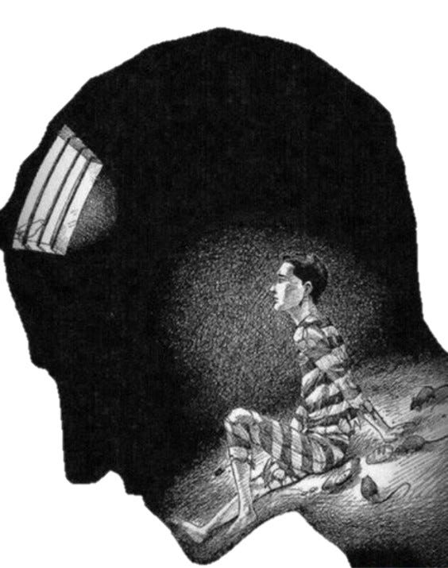
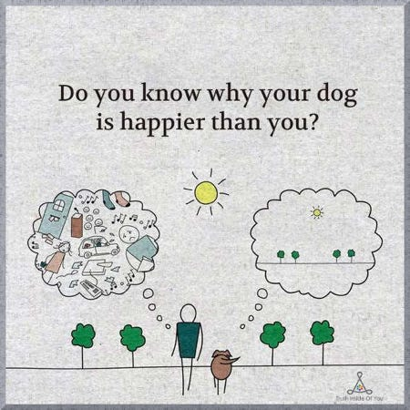
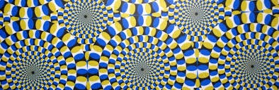
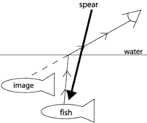

> The theory of the body is already a theory of perception.

– Merleau-Ponty

## Preface

I wrote my [Masters Thesis](https://integral-review.org/issues/vol_14_no_1_roy_awakened_perception_perception_as_participation.pdf)on perception. In it I argued for a complete overhaul on how we understand perception. I was fortunate to find many new discoveries in neuroscience to back my argument in established literature and research. I was interested in the topic because after two years of Consciousness studies, fusing eastern and western views, the basic conclusion was that (unlike the other animals) human perception was faulty, rarely to be trusted, and that everything we took to be real was likely an illusion.

In the west, Kant argued that the really real (noumenal) world could not be experienced; but that we could achieve a kind of one-to-one correspondence to it (aka make a map of it) if we properly used transcendental categories of math, logic, and analytic reasoning. This leads us to what I call "locked in syndrome." I want to suggest that this should be considered a diagnosis of modern madness, something gone terribly wrong with our human condition.

Many people have accepted the popular postmodern phrase "We don't see reality as it is, we see reality as we are." And yet- we don't ususally think this is the case with other animals. Most people, even philosophers who are idealists, believe in naive realism when it comes to their dogs.

There are two concise ways to counter these arguments: the case of athletes and the case of illusions.

**In the case of athletes**\
As part of the sensori-motor core self of our animal nature, perception has evolved to direct behavior, movement, gesture and action. In the case of athletes, there is no doubt that their perceptual organs--- the 6 senses, plus interoception, proprioception, and exteroception--- are strongly coupled with the environment in a precise way. The level of accuracy that athletes have to achieve are so remarkable, they seem to defy even [the laws of physics! ](https://www.amazon.com/Physics-Baseball-3rd-Robert-Adair/dp/0060084367/ref=sr_1_1?crid=3CNXCY0V3QYOG&keywords=the+physics+of+baseball&qid=1675425173&sprefix=the+physics+of+bas%2Caps%2C205&sr=8-1)[^1]

**In the case of illusions\
**While it may seem that illusions call perception in to question because, after all, they seem to fool the senses--- *that we know they are illusions* is also given to us by our perceptual organs. For example, in the illusion below, you may be simultaneoulsy "seeing" the circles rotate and "knowing" that the rotation is merely an illusion.

Here is one I like to play around with, which requires a little more imagination to work out what is happening here:

## **Perception is Participatory Cognition**

Perception is our primordial cognizing system. "Co-gnize" ("co-gnosis) means to "together know". The first sense of this is that the perceptual organs **participate together** in complex ways to integrate all the information into a gestalt of a cognized whole. Perception, however, is deeply reliant on ***participation with the world** --- *on movement and manipulation with the world that we want to "together-know." Our perception adjusts for "errors" by means of feedback with/in the world. For example, Amazonian spearfishers "intuitively" account for refraction of light in water. And neuroscientists have shown that when you put a camera-goggles on people which flips the scene up-side down, or where the video feedback delays movement, it doesn't take long for people's perceptual system to adjust and re-calibrate the information to fit "actions that satisfy" real world conditions.

Some people claim these are reasons to argue that direct perception is not possible. My argument is that perception is a holistic participation, and can't be isolated to discrete parts of the body, like the retina + brain. In fact, research has shown us that "sight" is highly dependent on and guided by hearing --- the reason why echolocation with blind people is possible. [^2] What if I told you that "sight" is also dependent on micro-gestures in your body? Eye saccades are important to seeing, but what about your mouth? Consider how you manage to thread a needle when you know that you cannot actually "see" the eye. You can feel the thread against the needle, but did you ever notice what you do with your mouth? Often you are guiding your hands by moving your mouth. The mouth is evolutionarily closely related to the sense of touch, and sight. Before animals evolved hands -- which is most animals-- they had to touch things with their mouths. And horses, who have long noses and literally cannot see what is down and straight in front of them, use their mouths to "see" correctly. Good so far? What if I told you that the perceptual organ we call "sight" is also dependent on your feet? Well, research shows that if you take a litter of kittens (which are born blind) and allow half of them to walk around normally, and put the other half in a wagon, and pull them around with the others, the ones in the wagon-- who were not allowed to use their feet, remain functionally blind![^3]

Thinking of perception as holistically interdependent, participatory together-knowing, embodied and embedded in/with/as world, helps us become more confident in encountering the world as real, as home, and as in a sense both "for" us and us "for" the world. We also come to understand that this together-knowing is a continuous, on-going exploration, where we try to become more attuned with the world in order to let more of reality into our awareness--- to pull more of reality together, The self who perceives is the thread that connects. In this sense we are weavers of reality, gathering infinite aspects into singular wholes --- the moment of perceptual realization.

## Direct Perception is *Adequate* Participation

How *much* participation is required to cognize the world directly depends on the complexity of the situation. Sometimes the participation involves an entire industry to build microscopes or telescopes so that we can see. This means that the "perceptual organ" we call "sight" is vastly extended into the world, distributed in space and time. It includes both the evolution of the body *as well as* the industrial and scientific revolutions!

## What are you participating with?

The fact is that every single second, millions of bits of information flood in through our senses. But our consciousness processes only perhaps forty bits a second -- at most. Millions and millions of bits are condensed to a conscious experience that contains practically no information at all. Every single second, every one of us discards millions of bits in order to arrive at the special state known as consciousness. But in itself, consciousness has very little to do with information. Consciousness involves information that is not present; information that has disappeared along the way.

> The eye sends at least ten million bits to the brain every second. The skin sends a million bits a second, the ear one hundred thousand, our smell sensors a further one hundred thousand bits a second, our taste buds perhaps a thousand bits a second. ... All in all, over eleven million bits a second from the world to our sensory mechanisms. We consciously perceive about forty bits a second -- and that figure is probably exaggerated.

– Tor Norretranders, *The User Illusion*

As moderns, we tend to get mesmerized by the feeble portions of experience--- the conscious, reflective and re-presentational aspects of our minds. And while most of what is involved in participatory knowing is inaccessible to consciousness--- we should remain vigilant as to what might be available in deeper prereflective awareness. [^4]

We can learn to trust the not-knowable aspects of the body, trusting that it is participating directly, together-knowing, with/as the world. This is the meaning of the Greek word *Aleithia*, which is a kind of truth that is deeper than knowing. It means that the truth is available to us *as us*, as inherent aspects of the real. Whitehead said we must resist the idea that we don't see nature as it is, because we are nature, seeing.

But we must continually ask ourselves "what am I participating with?" If I am participating with thoughts in my head, then I am nature, seeing thoughts. That the thoughts seem to be "pretending otherwise", that I take the thoughts to be something other than they are, leads to confusion and ultimately to delusion.

I can learn how to trace the thoughts to deeper, prereflective processes in the bodily-felt sensations. I can learn how to disentangle them from primary perceptual processing, and as a result rid them of their mesmerizing powers. This is a process of bringing awareness to the "background" processes which makes perception possible.

## Searching for the Background

> The body cognizes itself through its own body-consciousness, namely that of touch, which is "self-othering. The eye cannot see itself, the ear cannot hear itself, the tongue cannot taste itself, the scent organs cannot smell themselves. Neither can the self cognize itself; rather it is the outcome of a cognized moment.

> Only the body can cognize itself through its own body consciousness, namely that of touch, which like one's own two hands embracing, is simultaneously self-othering. In this very same way, the body's aspect consciousness, its kinesthetic awareness, simultaneously self-others the world.

> This is the definition of unmediated cognition -- the primary anchoring of perception in the world with/as the world's participation.

Background processes, not ordinarily available to conscious awareness are the fundamental operating system on which perceptual participation is "built." While other animals are capable of simulating the environment in their minds, humans can also simulate themselves in their minds. Because this happens in deep unconscious processing, which we have very little access to, we are seldom aware of the contribution it makes. By the time we reflect on it, we are already thinking with higher-order representations of the primary elements that constitute the background. The sense of "spaciousness" in some meditative practices, where everything in your visual field is gone dark, but you retain a sense of 3D "spherical" space, often expanding outward, sometimes buzzing with energy, sometimes with tiny points of light, gives us a sense of some of the on-going perceptual functions of this body-world sensing at the core of perception. [^5]

The emphasis here is away from body-as-schema and toward spatiality as given through the body. Remember, spatiality had been, for both Kant and Husserl, a transcendental category of experience. Merleau-Ponty points to the body as the "perceptual organ of spatiality." With latitude, we might say that the body "casts" spatiality, a field of continuous flux and flow which is simultaneously both body and world in participation. The body is expanded to mean, in a very real sense, an emanation of the space of participation.

> The world is experienced, not as a fully formed presence, but as a set of possibilities determined by an on-going dynamic interplay of environmental opportunities and sensorimotor abilities

– Gallagher & Zahavi

*That the body self-others* constitutes the core perception of self, other, and world in our experience. When we reflect on it, we get the (true) sense that we are experiencing only the simulation. However, at the level of the background, this is a true, direct perception--- what we sometimes call an "apperception." Some meditative states, but mostly psychoactive "plant medicine" can allow us to drop down into the more primordial processes, a deep sense of "being just a body" but what a remarkable thing a body is!

The mind's sense of time, rhythm and timing, also arise from the background processing of the body. Time in the mind is a virtual simulation of movement of the body, which is often why we imagine the passage of events as images along a timeline in a film.

The background processes also provide the affect-laden arousal energies that prime the "appetitive drive" of the senses--- giving them the *relevance* they need to pursue a goal (the satisfaction of the appetitive drive.) This is something that Goethe knew. The senses are not passive organs that function like windows opened up to let the world in. The senses are more like *cars on open roads* --- they are designed to go somewhere. Our senses are not passive receptors, they are dynamic and creative "illuminators" and "amplifyers" of experience.

Affect-laden "arousal energy" therefore is part of the primoridal perceptual stream. It is what affords the energies of the perceptual motion (the seed, as it were that germinates) but also what constrains the search-field to goal-directed, pusposeful relevance. [^6]

## Hylozoic Participation

If we trace any perceptual experience back down to the body's participation with the world, we find something interesting about language and thought. Consider, for example, making a soup. It is boiling and you are wafting the steam toward your nostrils and tasting sips of it with a spoon. If you describe your experience, there is the scent and the taste at one end, and the steam and the liquid at the other end of a spectrum. At one end the words refer to perceptual experience (scent, taste) at the other end the words refer to physical things in the world. (steam, liquid). If we try to close in on where world and experience meet, we find that language and thought are too coarse-grained to do this. It would be like trying to thread a needle with a jack hammer. There are code-switches at different points, tracing the scent (experience) through the nose (anatomical body part) , to receptors (nervous system parts), to molecules (physical parts) that activate receptor sites (not sure if these are physical or physiological, or both), which causes electrochemical signals (biochemistry)... etc.

In my thesis I coined the term "hylozoic zone" to refer to that zone of participation where the perceptual system is in contact with the world. [^7] From this zone, of which we can hardly say anything, somewhere between 10^7 and 10^11 bits of information drive the sensemaking uphierarchy toward more centralized regions along anatomical routes in the body, and oscillatory processes in the nervous system. Along the way, information is routed to and from, up and down the hierachy by "neural gates" creating an ultra-complex system of systems, through complex feedloops, timing delays, excitatory and inhibitory interactions, serial and parallel processing, and whole-part relationships. The net result can be thought of as a complex up-hierarchy architecture as follows (from deeper richer ground processes to higher, more coarse-grained ones)

1. Hylozoic zone
    - Participatory interface with/as world
2. Bodily Space ("the background" entails a manifold of serial processing systems
    -  interoception (relevance: well-being)
    -  proprioception (relevance: balance and skill)
    -  exteroception (relevance: action)
3. Object Space
    -  Allocentric modes (relevance: how objects are related to each other in the environment
    -  Egocentric modes (relevance: how objects are related back to "me" "mine" "my body"
    -  Mind-Space (deselection through serial processing)
        1.  eidetic, semantic sculpting
        2.  carving and chunking of information
4. I-me-Mine Self Complex
    -  Accommodating and assimilating perceptual dynamics with virtual components of mind, i.e. memories, mental models, narratives, linguistic, conceptual and abstract thinking, imagination, dream and fantasy.

## Direct Perception

As you read this, take a moment to reflect on the question:

**What are you participating with?**

There is not a lot of perceptual information in the grayscale marks on the page -- and yet they provide stimuli for all kinds of activities in your mind. The phonetic alphabets enable simple marks on the page to be modulated from exterior perceptual data (the markings) into interior, aural perceptions as speech inside your head. Speech in turn invites mental images, and associative memories and feelings that participate in chunking the information into packages of salient meaning. The message I am trying to convey is translated into meaning you are attempting to make. The meaning is always a variant of the message. Participation is never replication. It always creates emergent novelty.

It is safe to assume, then, that what you are participating with as you read this, is similar to what I am participating with in writing it--- we are attempting to create, diachronically, a shared simulation! If you grok this reality, then what I am saying is that we have a direct perception of a shared simulation. There is no reason to assume that we have to run a simulation of the simulation to have a perception of it.

The Zen notion of direct perception was never meant to suggest that we can see the world as it is. It is more correct to say that the awakened state sees the perception for what it is. Perception is a matter of degrees of constraints in an infinite field of participation. The first, obvious constraint, is our human species biology. A second constraint involves our individual physiology -- whether the perceptual organs are fully developed and healthy; as well their degree of skill, i.e. degree of attunement, refinement and acuity. A third constraint is state-specific and concerns a person's thresholds for conscious awareness -- our ability to be "aware of" if not "fully conscious of" for example, the saccadic movements of my eyes, the perspectival constraints of my language, or even the normally pre-attentive ground of perceptual experience. While it is not possible to break through the first two constraints, direct perception in the Zen sense of Kensho-awareness, deepens and expands awareness such that it lowers the threshold of consciousness, such that even the background composition enters into the perceptual experience. Still, amongst these rare experience that qualify as Kensho, there are different degrees of perceptual awareness. The full spectrum of the perceptual experience might not come into conscious awareness all at once. There are often initial phases of absorption in the spatial ground, followed by an intensely vivid, and polymodal synesthetic "surround sound" phase whose panoramic vistas may (or may not) be accompanied by a subtle egocentric reference.

The reason why modern people find it so hard to believe in direct perception is that they construe it to mean "the mind-brain" directly perceives the world, when in fact perception is a continuous proceses *from world to mind through the body*. That the conscious mind is only aware of a fraction of the information, and albeit, in a permutated form--- generalized and coarse-grained--- does not mean that the perceptual organs of the embodied body-mind are not in direct participation with/as the world.

If, on the other hand, your primary participation is with thoughts in your head, then it would be correct to say that you are having a direct access to perceptions that have been simulated or virtualized "as mind." We know these virtual perceptions are micro-actions, or subthreshold events that trace the same sensori-motor pathways and global oscillation patterns that respond to and interact with external senses that are coupled to behavioral action. Research shows that, just like coarse-grained, low resolution, highly pixelated images retrieve some but little of the information of the HD photo-realistic one, these virtual perceptions, because they loop through internal structures at higher levels atop the up-hierarchy, are experiences of fuzzy, low-information phenomena.

## Wrap

Perception has evolved to be keyed with action. Affect-laden arousal in the body primes perception with relevance, and provides the appetitive energies that drive the senses toward realization or satisfaction toward an object-act that satisfies the original arousal. Perception thus originates in affect-laden *values* at one end of the perceptual stream.

The affect stream branches out through multi-valent subsystems which are integrated at successive neural gates, much in the same way that rivers branch out and come together, branch out and come together. When the objects that satisfy are "perceived" the *values* that originate at the beginning are "discharged" onto the object and action is directed toward it. Perception therefore is the connection between internal and external value, and the body is the bi-directional conduit.

When the arousal drive turns inward toward virtual perception, the values are discharged onto images and semantic units, constituting the meaning and sensmaking capacities of the human mind.

When the arousal drive discharges onto the I-me-mine complex, the original values are associated with and contribute to our sense of identity, atop the sensemaking hierarchy.

**[Bonus points]**

## The Gelukba's Sautrantika

[This section is from Anne C Klein's *Knowledge and Liberation*. Not for the faint of heart. Offered for the Buddhist skeptics amongst us :-) ]

The Gelukba's hold that conceptual thought can lead to direct perception and the nonconceptual realization of self-liberating insight. This possibility however depends on having a correct conceptual framework. There are several key tenets to the Gelukba's framework.

The first tenet has to do with ultimate truths, which are non-conceptual and apprehended directly, and conventional truths, which rely on conceptual apprehension. The key characteristics of ultimate truths is that they apprehend what is called "specifically characterized, impermanent phenomena"; whereas conceptual truths apprehend "generally characterized phenomena."

William James (1977) also noticed this distinction between perceptual flux and flow, the "big blooming buzzing confusion," the "aboriginal sensible muchness" and the concept which "never varies" and "expresses eternal veritas." In the western mind, it was therefore the "staying power" of the concept, James noted, to "contrast the knowledge of universals and intelligibles as god- like, dignified, and honorable to the knower, with that of particulars and sensibles as somethingrelatively base which more allies us with the beasts. Hence these conceptual, intelligible universals were associated with ultimate truths in the western mind. "... by all rationalist authors the ultimate reality is supposed to be static also, while perceptual life fairly boils over with activity and change.

In the three highest Buddhist systems, Sautrantika, Cittamatra, and Madhyamaka, the opposite position was established, where only the impermanent, non-conceptual and specifically characterized were considered as ultimate truths. In line with the Buddhist schools, James understood that that to be conceptually known, "our flowing life must be cut into discrete bits and pinned upon a fixed relational scheme." James understood the problem with intellectualism, is the need to pin something down, as a fixed, permanent thing, and the farther we push it down the path of conceptual definition, the farther and farther removed it is from perceptual experience, which is movement, flux, variety, change -- in other words, impermanence.

But intellectualism quickly breaks down. When we try to exhaust motion by conceiving it as a summation of parts ad infinitum, we find only insufficiency, Although, when you have a continuum given, you can make cuts and dots in it ad libitum, enumerating the dots and cuts will not give you your continuum back. The rationalist mind admits this; but instead of seeing that the fault is with the concepts, it blames the perceptual flux.

The Buddhist schools, on the other hand, understood impermanence, motion, flux, and change as the first noble truth; and the direct ascertainment of subtle impermanence as a sign of the highest instance of direct perception. In the Gelukba's framework, impermanent things fully appear to direct perception, and permanent things are apprehended by conceptual thought.

Furthermore, what makes the things apprehended by conceptual thought, permanent, is not that they themselves are lasting and eternal, as thoughts come and go just like everything else in the phenomenal continuum. What makes them "permanent" is their ability to affix a single, unchanging generalized category, onto phenomena that are otherwise always undergoing continuous change -- regardless whether that change is observable or imperceptible.

Consider, for example, the category "chair." The conceptual mind is happy to stick with this term, regardless of whether the chair has three legs or four, undergoes multiple replacement parts, is constructed ad hoc by a convenient stump on the side of the road, or is displayed as an image on a screen. Despite these dramatic differences, the word chair remains the same. The instances of all the "chair" themselves is never specified, but only generally characterized.

In the Gelukba's view, conceptions are valuable because they are essential tools for overcoming ignorance. And yet, our primary ignorance results from not recognizing the generalizing, categorizing, static and reifying nature of conceptual thought. This too can be directly perceived, through non-conceptual meditative awareness of the thought processes.

In the Gelukba system, each perceptual organ is understood to be its own consciousness -- eye consciousness, ear consciousness, taste consciousness, etc. These are said to be hampered by their lack of ascertainment. The mind also has its own consciousness, which is said to be "hampered by a lack of specificity." Yet, according to the Sautrantika view, each type of consciousness -- sensory and mental -- are ultimate consciousnesses when directly perceived.

To perceive directly means to "engage with the entire collection of features," in other words, to be aware of the ecological field of participation, from world to thought and back again. In doing so, we see that conceptual thought is not the omega point of conscious arising. Rather it is just another node in a continuous network of flow.

A conceptual thought, which is an object of mental consciousness, takes on the appearance of standing in for the whole, but the individual who perceives the experiential flow knows otherwise. Each thought is an iota, a grain of sand in an endless desert, whose shape constantly shifts in the eternal winds. An ultimately valid knowledge would be simultaneous awareness of the grain (the perceptual data) the desert (the generalized whole), and the shifting winds (the process of cognizing whole experiences).

An ultimately valid object -- whether it be a thing, a feeling, a thought, a concept -- would therefore be defined as a "set of direct perceptions that satisfy a duration of mind." The duration of mind might remain below the threshold where the hylozoic zone emerges from the world, and as such remain simply, world. The duration of mind might extend all the way through the formative processes of the fully articulated, self-reflective I-me-mine. The duration of mind might extend into the spaces that overlay the ecological field of participation, constituting novel states of experience. This notion of duration, is complementary to the Gelukba's emphasis on the process nature of consciousness .

Conceptual thought and direct perception can operate simultaneously, but they are not established or initiated simultaneously with respect to the same object. In the first moment of seeing an impermanent object such as a tree, direct perception -- the eye consciousness -- is active' then there is a moment of mental direct perception, which cannot be noticed by ordinary persons. Following this, conceptuality begins to operate. Thus, in the first period there is only direct, clear perception by the eye consciousness; once conceptuality begins, it operates simultaneously with subsequent moments of direct perception. This means that while the eye consciousness, for example, is apprehending the specific characteristics of its object, the thought derived from that eye consciousness superimposes a meaning generality onto that object.

"By understanding the profound compatibility between thought and insight," writes Klein one can have confidence that what begins as a mere echo of sound in the mind can progress to actual direct experience."

A new theory of the body would incorporate an ecological theory of perception and help to build confidence that experience of everyday ordinary affective, perceptual and conceptual phenomena, is offered as a "good enough" starting point, to understand direct perception, since, as Klein tells us, the Gelukbas emphatically believed:

"The starting point is precisely the ordinary type of conceptuality and direct perception one now has."

## Further Resources

<figure>
    
    <figcaption>
        <a target="_blrank" href="https://bonnittaroy.substack.com/p/video-on-perceptual-density/comments">View Original Content</a></figcaption>
</figure>

<figure>
    
<iframe src="https://player.vimeo.com/video/17148626?badge=0&amp;autopause=0&amp;player_id=0&amp;app_id=58479" frameborder="0" allow="autoplay; fullscreen; picture-in-picture; clipboard-write" style="position:absolute;top:0;left:0;width:100%;height:100%;" title="Documentaire - I feel... (Ik voel, ik voel, wat jij niet voelt...)"></iframe>

    <figcaption>
        <a target="_blrank" href="https://bonnittaroy.substack.com/p/video-on-perceptual-density/comments">View Original Content</a></figcaption>
</figure>

- [Original Content Material](https://bonnittaroy.substack.com/p/on-perception/comments)
- https://thesideview.co/journal/cognition-in-the-wild/

## Cohorts

> [!info] Note that access requires a paid membership.

- [Cohort 1](https://bonnittaroy.substack.com/p/video-recording-perception-cohort/)
- [Cohort 2,3,4](https://bonnittaroy.substack.com/p/video-recordings-perception-cohorts/)
- [Cohort 5](https://bonnittaroy.substack.com/p/video-recording-perception-cohort-28b/)

[^1]: If perception proved not to be trustworthy in the mind of philosophers it would prove to be more than trustworthy in the bodies of extreme athletes who had trained to be able to give up thinking when it mattered most.

    > When he went to strap on his chute, he noticed the canopy was wet. It should have been the end of his plans. A wet chute is unevenly weighted. When deployed, parts will inflate, otherswill not. Potter, not thinking clearly, decided the water was evenly dispersed and wouldn'tbe a problem.
    >
    > And it wasn't a problem -- at least not for the first five seconds of the jump. "When I leaped,"he says, it was right into the zone. Immediately my senses started peaking. I was moving at ninety miles per hour but could see in credible detail -- minute fissures in the rock, tiny patches of lichen, bat guano. At the six-second mark, roughly 500 feet from the ground Potter deployed his chute. It opened asymmetrically. The wet sections collapsed, the dry ones inflated. Instantly, with the air currents unevenly distributed, Potter started spinning. From above, his friends started shouting "Avoid the walls!" Important safety tip, except with his guidelines twisted, there was no way to steer.
    >
    > yanking his toggles. He knew the better move was to reverse his direction-- which would have sent him backward and out into open space -- but for reasons he still cannot fathom he turned left instead. He was now heading directly toward the cave wall. Worse, the moment he turned, his chute collapsed, draping itself completely over his head.
    >
    > But Potter's ***senses were peaking***. In the fleeting instant before his vision vanished, he caught a glimpse of orange. "We were filing the jumps," he recounts, "so we'd hung a rope about 400 feet off the deck for the camera man. It was glowing orange. And that was what I saw: a flash of glowing orange."
    >
    > He reacted immediately, grabbing for the rope, catching it too. But there was no way to tighten his grip. Potter was less than 300 feet from the ground and closing in on terminal velocity. His hands were already burning from the friction. When he tried to clamp down on the rope, his flesh flayed, then instantly cauterized. The pain was unbelievable.
    >
    > ... Potter did manage to stop himself for a moment -- but couldn't hold it.
    >
    > Again he started plummeting. Again he clamped down. Again he managed to stop. Not a moment too soon. With the chute still covering his eyes, he had no way of knowing, but Potter had halted himself merely six feet above the ground.
    >
    > His friends shouted down "Just let go!"
    >
    > Potter landed in a heap on the cave floor. His hands were destroyed, other parts as well.

    – Excerpted from Steven Kotler *Rise of Superman*

[^2]: Daniel Kisch once visited here at the farm, and it was uncanny how he could "see" the wire fencing and find the openings that are so small that people can only slip through sideways; and it was wonderful watching him interact with the horses with his hands and whole body.

[^3]: This notion of perception as participation with/in the world is associated with the 4E Theory of cognition, namely that perception-as-cognizing is *extended* into/as the world.

[^4]: Consider, as an example, the Buddhist story of the man who mistakes a rope for a snake. Assuming his sensory organs and brain are normal, we would say that the sensory organs are perceiving the qualities of the rope, in the context of the light, angle, sounds, how much of the rope is exposed, etc. Some of this information reaches the conscious mind-brain, and some of it does not. In addition, the mind-brain is processing memories and thoughts, and incorporating imaginative "leaps" while attempting to integrate these into the sensory information to get a "full understanding" of the situation. Now remember, embodiment means participation. As all these elements of the embodied experience come together, some aspects will become more conscious to the "I" and some will be "deselected" from the conscious experience. The conscious mind that emerges, depends upon what information is selected and what is deselected. The conscious "I" therefore, ends up participating with an incomplete set of information. If the information that is "served up" to the "I" is heavily biased by memories of being bitten by a snake, or by warnings that primed the imagination to see a snake, then we would say the "mind" is participating with the idea of a snake, rather than the perception of a rope.

[^5]: James H. Austin describes the perceptual spaces of the body as "the normally hidden capacity for sensate inferences." It allows us to maneuver in 360 degree (i.e. circumspatial) space through a holistic integration of position, balance, movement, and enormous processing of incoming perceptual information. Unlike ordinary, conscious perception, which references experience to the body as a single point location and the world in front of our eyes -- or even unlike inner mental images and thoughts that do the same -- the body's perceptual space includes the everexpanding and unfolding continuum of space in all directions. Hence, the athlete's space becomes an enlarged skill-filled volume of possibility. The outfielder runs in concert with the ball before the crack of the bat, negotiating body and ball through vast, circumspatial trajectories, just as we "know without thinking" to "reach without looking" behind us for our scissors or beneath us for our keys.

[^6]: This is the simple, direct answer to John Vervaeke's question of relevance realization. John can't answer it because he thinks it has something to do with processes internal to the brain-mind, whereas relevance is set much earlier, in the deeper processes of the body. "Realization" is the experience of the satisfaction, which also discharges back into the body as dispositional sensation.

[^7]: [Hylozoism](https://en.wikipedia.org/wiki/Hylozoism) is a philsophical point of view that matter is in some sense alive, and that life is in some way derivative of matter. It also refers to [architectural elements ](https://www.amazon.com/Hylozoic-Ground-Liminal-Responsive-Architecture/dp/192672402X)which are both like physical things we can build features with, but also are like living things in that they are capable of self-replicating and self-repair and responsive to interactions in the environment.

