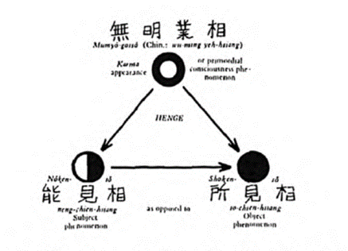

> Nobody knows how people do it. The unconscious mind gives it,\
seemingly for free, to the thinking person.

– Gilles Fauconnier

## Language Games

Language originates in our animal bodies. There are four basic forms of "talk" ---

1. Sounds that point out bodily states: a horse nickers to her baby, puppy whimpers to its mom, dog growls at a stranger and begs for food, mating calls and territorial alarms. (Dogs can also tell you its time to end the zoom meeting!)
2. Sounds that point to something: baby saying "babba" to point to the bottle, or "kitty" to point to the kitten, the hunter quietly says "deer."
3. Sounds that point to movement: up, down, here, there, before, after, around, over.
4. Sounds that point to qualities: good, bad, safe, unsafe, dangerous, bright, dark, and also colors.

The earliest vocalizations are tightly coupled to gestures, and evolved from them. They are extensions of the body across space. I can say more things than I can point to.

By the time a child is introduced to books, they understand 100 - 200 words. The first book contains images of things the child already knows the word for. The parent points to the image of the dog and says "dog." Then they point to the text "dog" ad say "dog." The child learns by association, but this already entails synaesthesia--- something that *looks like* "d o g" can *sound like* "dog." Eventually, the child associates each letter, or phoneme, with sounds. A well supported 7 year old knows 4000 words and read 600.[^1]

## Foundations of Representational Thinking

In the module on Memory, we've already discussed how during REM sleep, 1st-person events that are active in the central nervous system, become displaced by mapping the events in other parts of the body-mind. We discussed the relationship between memory and place cells, and how memories of moving through environments based on egocentric perceptual processing, become coded as allocentric maps of locations in the environment. We also discussed how when animals dream, they run simulations in imagined environments, and these simulations become part of the map. In this way, the map comes to include hypothetical situations that we have had no previous experience with, but which we can draw on if and when that situation presents itself. It is an extremely important part of how animals learn to orient toward futures that they have not had to adapt to in real life.

These "maps" are already primordial kinds of abstractions! In human children we talk about these early maps as "image schema," which are the foundations of complex psychological structures, including subpersonalities, various kinds of internal working models, and archetypes.

Jean Mandler describes how animal perception includes an active process of organizing experience in various ways, and this occurs very early in life in infancy. She proposes that this "image schematics" is the first step on the conceptual organizational ladder. She notes that the earliest and most primitive forms of representation are "conceptual structures mapped *from spatial *structures."

> Image schemas are notions such as PATH, UP-DOWN, CONTAINMENT, FORCE, PART-WHOLE and LINK notions are thought to be derived from perceptual structure. For example, the image schema PATH is the simplest conceptualization of any object following any trajectory through space without regard to the characteristics of the object or the details of the trajectory itself.

Lakoff and Johnson's work on adult linguistic and conceptual construction, echoes her understanding, showing how image schemas lie at the core of people's understanding of a wide variety of objects and events and of the metaphorical extensions of these concepts to more abstract realms, forming, in effect, a set of primitive meanings.

Representations, then, begin in processes that recode procedural learnings (walking, grasping, balancing, speaking, pointing, sucking, eating) into maps which organize them into categories. The original events in the external world become codified as schemas in the internal world of the psyche. These schema collect information across different domains, and therefore can be accessed for learning in other areas.

There is a stage-dependency to the development of representational redescription and abstract coding. Before the child learns linguistic structures, these representations are first procedural, and then spatial and kinaesthetic. Representations become increasingly verbal and the coding increasingly semantic and conceptual. Lakoff and Johnson then show how, through metaphorical extension, these early categories are projected onto abstractions, which compress the information only symbolic forms; and finally more sophisticated thinking involves the cross-modal blending of these conceptual abstractions.

**Metaphors set the stage for representational thinking**

During the early Confucian period in China, there were fierce debates about the nature of wisdom. Confucius believed that wisdom had to be cultivated by faithfully following rituals based in social norms and conventions. The Daoists, Lao Tzu and Zhuang Xi, however argued that wisdom was innate and to tap into it, a person had to drop the characteristics of "people in general" and return to a primordial, wild intelligence.

The arguments were based on powerful metaphors. The Confucians used the metaphor of well-designed irrigation systems that prevented the waters from flooding, and provided the "virtues" needed for farming. The Daoists countered by saying that wisdom was the very power of the flood waters themselves, and that civilization, by taming the water, headed itself for demise.

It is easy for us to see that these arguments, based on metaphorical reasoning, are somewhat silly, since the metaphors that are used function only to confirm the bias that is already held in the opinon of the person. Every opinon can be "justified" by creating a metaphorical link to another feature. When this metaphorical link is to something that exists in nature, we call it the *naturalistic fallacy.*

Today, however, we argue in much the same way. If a baby is a human, then abortion is murder; if the fetus is part of the mother's body, then abortion is a mother's choice. The metaphor (or conceptual "blend") cannot possibly provide us with moral justification. Rather, the metaphor functions like (here comes another metaphor) a good friend you ask to accompany you to the debate. As language and conceptual density becomes ore saturated, it is hard to see, and almost impossible to avoid getting trapped by conceptual blending that is based purely on a deep and wide net of metaphorical crossing (where one metaphor bleeds into another). If the speaker establishes the premise through a hidden metaphor, then the argument is already lost. This happens to be the ruse in which *all of Jordan Peterson's work is situated.*

Peterson uses the naturalistic fallacy a lot (lobsters!) but also his arguments become saturated with metaphorical thinking when he appeals to the archetypes. The archetypes are, symbolic instantiations of metaphorical assumptions. [^2] The archetypes of the masculine and feminine, for example, are based on clustering different characteristics, metaphorically, onto the terms "masculine" and "feminine" --- what it is *to be like* a man, what it is *to be like* a woman --- are their fundamental constructions. The archetypes populate the terms through metaphorical-crossing: A man is like fire, a woman is like water; men are from mars, women are from venus.

Now consider any topic on social media that has your interest, and makes your blood boil. What are the deeper, metaphorical foundations that your side and the other side depend upon? Maybe you are pointing to "the data" as evidence. The problem with this is that we have programmed our algorithms to see the "data" in terms of the metaphors we use. Furthermore, people already understand the "metaphorical territory" associated with the different categories that data is programmed to mine. So, for example, when I go to check "white" on a census, I feel cringe, because that category has come to be metaphorically entangled with all kinds of characteristics that I don't want to be associated with. [^3]

> [!note]
> One aspect of writing that was easy, was unstoppable, and that was the flow of imagery that ran through my head like a creek in a flood--- no--- like the babble of voices around a bar at happy hour--- no---lie a stream of ants toward a source of sugar---oh, no--- like carp rise to a dimple of bread--- oh, no--- oh, no--- a cloud of gnats--- a gigled when ticked. An attack of bats. I couldsway away six and still write eight. I was always looking at the world from another word.
>
> – William Gass

## Archetypes and Narrative (The Hero's Journey)

Jean Knox[^4] defines archetypes as the earliest forms of representation that can never become explicit because they exist in the more primordial schematic and procedural format:

> Cause and effect may be connected in these very early representations. ... However, these early implicit representations do not contain the complex symbolic conepts that develop through the process of representational redescription and that form the basis of the older child's capacity to recognize and describe an animal in words or pictures. These primitive representations are non-propositional and cannot contain explicit symbolic content.

Explicit symbolic content is later added onto or blending with the deeper archetypes through cultural conditioning. Hence the explicit symbols vary across cultures. However, since the pattern of learning itself is nearly identical for all children, because they share the same anatomy and physiology and encounter the same key features of the environment that the child's attention focuses on, the archetypes themselves are constant across all cultures. There is no need to imagine something like collective memory or transgenerational trauma. These are inherently linguistic-symbolic content carried over from stories of a people's history, that are overlaid onto the primoridal archetypes that develop naturally in all children.

The image schema develops out of bodily experience and forms the basis for more abstract meaning. They are the psychical and mental structures which blend the perception and action events of the external world we participate with and act in, with the primordial, internally sensed kinaesthetic and procedural events that become associated with those events. This is the fundamental definition of how "habitat" becomes internalized as action protocols or "habitas."

As culturally specific archetypal images and linguistic forms come to dominate the interior mind and psyche of the person, creating a rich symbolic language, the original primordial schemas become buried deeper into the subconscious. This is the beginning of representational thinking. Under certain social and cultural conditions, like those that exist in the modern west, hypertrophic left-brain processes dominate the structural composition of the symbolic mind, culling the sensual and perceptual particulars of experience, through the process of *symbolic magnification*. The richness of the earlier symbolic potential, becomes replaced with the poverty of a small set of, hypertrophied symbols. As a result, representational thinking becomes simulated thinking, detached from the arising and passing phenomenal landscape of the living, relational body-nature. In this kind of simulated thinking, stereotypes that mime cultural prejudices, masquerade as archetypes. Unfortunately entire cultural reality as well as individual spiritual communities are founded on this kind of symbolic magnification.

---

**Complexes**

Individual and cultural "complexes" are like "knots" that are woven of unconscious symbols, thoughts, and beliefs which share a central emotional theme. It is because the primordial image schemas are inaccessible, and the archetypes symbolically impoverished, that the emotional valence of the complexes are so resilient to reflexive inquiry. Once however, these factors become transparent, one discovers that there is actually very little energy to be found at the core. Rather, the complexes require continual maintenance, and function as a debilitating drain of valuable physiological, psychic, intellectual and spiritual resources.[^5]

The relationships represented in complexes function as the most primitive forms of "story" even prior to the development of language. The complex "mother, father, child" has inherent meaning, in the sense that it already implies a story for you. Pay attention to the implicit felt sense, or felt meaning, that this has for you, and you will understand how deeply "en-storied" your internal reality is. These primoridal stories are the fundamental level of meaning, for without them, images and schema would still be functional structures that organize reality, but would remain functionally meaningless.

Now this is why I would argue that other animals also have en-storied internal lives at this base pre-linguistic, pre-reflective, primoridal level. Consider for example, that they have preferences that cannot be explained by physiological benefit, and sometimes actually go against what might otherwise be of physiological benefit. The puppy carries around this blanket or this toy, instead of any others, because they have tied a story to it, in the same way that a child en-stories a blanket or a toy.

Stories, therefore, are the heart of meaning-making. The most powerful ones have deep roots in unconscious processes. But some stories do not serve us or others well, and some deeply rooted stories are debilitating to our physiological and mental health. There are stories that compose "cultural complexes" that are responsible for the insanity of the entire western world, and are becoming increasingly explicit forms of modern madness.

The stories implicit in complexes involve primitive, circular relationships, often among three characters (or elements)--- the most common one being mother-father-child. It is my hypothesis that this is why Charles Sanders Peirce saw triples as being primoridal structures of the psyche and the mind, proposing that traids or triples are fundamental units of meaning in human cognition and language. [^6]Peirce claimed that all meaningful signs or forms could be analyzed in terms of their triadic relations. [^7]

Eventually, language re-represented primordial complexes in increasingly elaborated lyrical arcs and increasingly complex (sic) narrative structures on to today's post-modern and metamodern experiments in fiction and film. However, we are never really distanced far from the essential core elements of the "archetypal" stories at the level of the image schema and their complexes. [^8]

## Mental Models

In his books, *Origins of the Modern Mind* and *A Mind so Rare, *Merlin Donald describes how the human mind has evolved, through three distinct evolutionary-anthropological mutations, a tripartite structure: mimetic-episodic, semantic-narrative, and abstract-theoretic. These correspond to soma, psyche and mind. The three layers are semi-independent in such a way that the structure of the earlier layers are exapted to the more recent domains. The earliest perceptual schemas are reflected in the psychic schemas and complexes, and the narrative relationships in the complexes are exapted into increasingly abstract "internal working models." Above a certain level of abstraction, these internal working models form complex mental models which compose hidden metaphysical stories about space, time and reality. The relationships in the primitive complexes develop into causal theories, both evolutionarily with the human species, as well as in the development of the child. In our course on the core self we saw how the complex "self-other-world" embeds in us a theory of causality.

Metaphysical primes such as time, space, and causality underlie all representational thinking. They are fundamental to the functioning of all human reasoning, includig science.

## Justification

Between dogmatism and relativism there lies a field that is not bound to belief.

> We must simply learn to *just see* what is actually presented in experience rather than rely upon **any** belief whatsoever. In so doing we'll be able to *see* that it is precisely in holding our beliefs that we make a profound conceptual mistake. We must learn to rely solely on what we *see* rather than upon what we think. ~ Steve Hagen: *Why the World Doesn't Seem to Make Sense: An Inquiry into Science, Philosophy and Perception*

Any attempt to give a clear definition to belief draws it into question, dispute and doubt, which in turn "turns up the heat" of the justification system.

> [!note]
> Knowing produces doubt, doubt produces fear, fear produces questions and questions produce beliefs, on which more knowledge is built.

The world we live in is a complex network of justification. Socieities coordinate and organize around justification systems. Whenever we say something, the validity and meaning is related to a particular justification system. There are thousands of such systems that run from the personal to the institutional, from cults to culture. Justification Systems, as defined by Gregg Henriques, are based on propositional knowledge systems that attempt to establish both the "is" and the "ought" of things.

In our embodiment course, we saw that there are two perceptual systems --- the self-referential egocentric system, and the other-to-other referential allocentric system. We saw how when perception becomes virtualized (as micro-actions in the body-mind) it establishes both a self-referential evaluative aspect of mind, and an allocentric evaluative aspect of mind. The self-referental aspect evaluates according to what is good/bad, positive/negative *for me*. The allocentric evaluates objects with respect to each other: closer/further; bigger/smaller; faster/slower; rotated/not rotated.

In the mind, these two subsystems are associated with what we call "psyche" --- which is self-referential and "mind" --- which simulates the objective environment. The psyche then is the "ought" system, and the mind is the "is" system. Therefore, in our Theory of the Body, we can trace the origins and root ground of the Justification System in the virtual perceptions, and the virtual perceptions in the animal body's sensori-motor processes.

## Speech as Action-Protocols

I believe that language is extremely important component of dialogue in this time of crises. Mostly we use language to justify opinions or beliefs. I think we need to start thinking of language as powerful action protocols. Language is a key component in the production of subjectivity. If bodies curve space, then language curves thought. So when we speak, we need to be aware of the effect are we having on the thought-system of the person. How we construct abstractions is a significant part of this. Consider, for example, two words coined by Timothy Morton: "hyperobject," and "truth-feeling." I never use the word "hyperobject." I have written about why it is problematic. The word "hyperobject" seems like it is a pointing- to word, but the very definition of "hyperobject" is that evades any cognitive grip. What the term "hyperobject" really is, is a "set-term." Like the joke about the tourist walking through the streets of Cambridge, asking "Where is Harvard?" "Harvard" is the set of all buildings, people, activities, etc... Only the parts of set-terms can be pointed to. And some set-terms contain parts that are themselves set-terms. The net effect of using set-terms unskillfully, is that it creates distance between abstraction and understanding, and renders the person impotent to act within that frame. In other words, set-terms, which are a particular kind of abstraction, are inadequate to the tasks they appear to be talking about.

<Card>
You can't get there from here.
</Card>

The word "truth-feeling" however, is a pointing out word--- it is pointing out a bodily state that accompanies an insight, or deepening understanding of the true. It has a similar use as the German word "Sprachgefühl" which translates as "language-feeling" an refers to the common experience of bi-lingual speaker, that different languages shapes subjectivity in different ways, and evokes different worlds.

In this module, we will practice using language as action-protocols, which is a key skill in collective insight practice (similar to moving from the circle of presence to the circle of creation in Ria Baeck's model).

[Exercise on "Climate Change, Existential Risk, Meaning Crisis, Sensemaking Crisis, Enlightenment, Waking Up, Meta-Crisis, Systemic Racism, Transgender/ Gender Dysphoria]

## Further Resources

- [Original Content Material](https://bonnittaroy.substack.com/p/representational-thinking-narrative/comments)

## Cohorts

> [!info] Note that access requires a paid membership.

- [Cohorts 1,2,3](https://bonnittaroy.substack.com/p/video-recordings-representational/)

[^1]: According to their results, the average three-year-old test taker knows just over 3,000 words. The average four-year-old test taker knows over 4,000 words. The average eight-year-old test taker knows over 11,000 words. The average forty-year-old, by contrast, knows about 30,000 words

[^2]: The archetypes originated fomr lyrical poetry, where certain heroic characters were deeply stamped into people's consciousness.

[^3]: I have some Algonquin ancesters, but to claim I am Native American, or mixed blood doesn't seen accurate either. This problem of "naming" is exactly the problem that the Daoist, anti-language philosophy was rejecting, understanding that it would exacerbate social conflict.

[^4]: Jean Knox *Archetype, Attachment, Analysis *(p. 61)

[^5]: It is important to note that archetypes and schemas are epigenetic, in the sense that they arise from innate properties of the animal body, but are shaped by particular experiences and conditions into the specific forms they emerge. Pure abstractions, however, unlike archetypes and schemas, are more "genetic" in the sense that they are reflective of the native archi tecture of mind and patterns of the world, or, in other words, pure abstractions is how the mind directly enters the world, and how the world directly enters the mind.

[^6]: As does Forrest Landry in his work *Immanent Metaphysics. *And although Charles Hartshorne's process metaphysics simplified Peirce's triad to two contrasts --- r-terms (relative) and a-terms (absolutes), being a process philosopher, he would also necessarily include their relationship which, was "sublation" (s-term) resulting in the triple: r-term, a-term, and s-term.

[^7]: Although the yin-yang symbol has been popularized as the symbolic core of Daoism, in reality the trigrams play more of a central part, because the one, which becomes the two (yin-yang) automatically gives rise to the third (ten thousand things). It is also not trivial to note, that since the axial age irruption of the Mental structure of consciousness, with Plato's Ideals, stories took on a dualistic structure based on ultimate contrasts. This in turn predetermines the Hegelian synthetic structure of rationality. See especially Alfonso Verdu: *Dialectial Aspects in Bhuddist Thoughts for the evolution of Daoist metaphysics ex:*

    

[^8]: If you ever wonder about how paticle physics works, based on the triple: fundamental particles, fundamental forces, and fundamental interactions, and why this simple model can explain the entire universe, then you understand how elemental triples are, and that while they are formed in the mind, they arise in interaction with the world, as world. See

