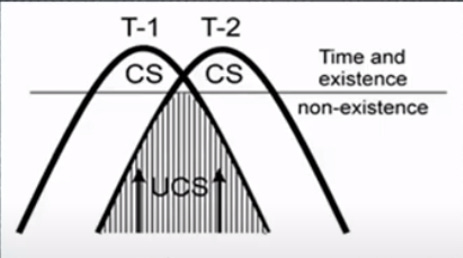
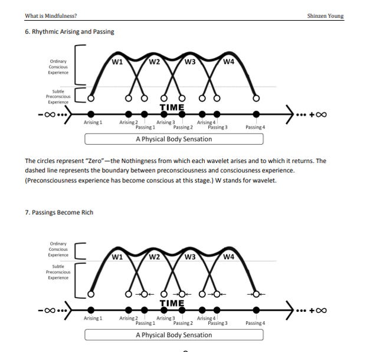

In this series I have been presenting a few [interaction metaphors](../../tags/interaction-metaphor) that should be helpful in our co-creating A New Theory of the Body.

- [[./up-hierarchy|Sense-making Up-Hierarchy]]
- [[./habitat-and-habitas|Habitat/ Habitas]]
- [[./action-protocols|Action Protocols]]
- [[./action-tresholds|Action Thresholds]]

In this article I want to introduce you to two terms that play an important role in understanding temporality of experience as a generative process: *duration* and *epoch.*

---

First we must imagine temporality as waves of experience arising from more primordial levels, reaching and passing various thresholds.

- Above a certain threshold, the inchoate sensations of bodily disposition or "mood" become subconscious affect-laden drives.
- Above a certain threshold, the subconscious affect-laden drives become elaborated by story and become emotions.
- Above a certain threshold, the emotions trigger speech acts and other behaviors.
- Abover a certain threshold the limbic system can become overwhelmed and a cascade of disregulated, dis-ruptive events ensue.

This sequence of events, however, is too simplistic to describe the micro- generative process of experience: *microgenesis of experience.* Not only are there many many waves at different temporal scales, at each scale the wave-like progression includes several overlapping waves. This means that the arising of the new wave begins before the earlier wave perishes. The latency of the new wave comes as the felt-sense of the future, the perishing of the old wave give us the felt-sense of passage---the specious present is stamped into their overlap. [^1]

Jason W Brown uses the term microgenesis to describe a process theory of experience. Here is a slide from one of [his presentations](https://youtu.be/wNZW5hKlDSQ), illustrating the overlapping temporics of the waves, where UCS is unconscious background processing which remains below the threshold of consciously experienced (CS) moments, T-1 and T-2.

Notice how this overlap --- what we might think of an "excess of creativity in nature" accounts for the continuity of process in the heart of the experience of discrete moments.[^2] According to Brown, the microgenetic processes of human experience reflect a deeper universal generative principle of the creative cosmos.

In the illustration above, the entire two-beat pattern constitutes an **epoch**, while each instance of conscious existence is a **duration**. We can say, along with Brown, that the epoch-duration is a whole-part relation, which is universal principle of a cosmos continuously becoming-into-being:

> In this respect, some features of the mind/brain state that are presumably common to pysical enetities are becoming-into-being, the epochal nature of things and the problem of continuity and atomicity. In this mix, the whole-part relation is universsal, interpreted as the whole of an epoch that enfolds the parts (phases) of its becoming, or the whole of the onset of the epoch in relation to the particulars that emerge on completion.

Meditative awareness, stretches the duration across more of the epoch, such that we begin to consciously experience the coming-into-being of the thought forms from the deep netherworlds of bodily process, like a dreamscape slowly unfolding on its way to perishing. In heightened states of perceptual acuity like kensho or satori, there is a phase shift in the opposite direction, such that the conscious perception is simultaneously present with the upswell of its becoming in which the startling beauty of reality arises, and time itself is lost, along with the sense of self which relies on it. Finally, meditative absorptions such as the jhanas, postpone the duration to varying degrees until, in the deepest states, only unconscious processing remains without any shift in phase.[^3]

## Sculpt your insights further

> [!info] [[./temporality/glossary|Glossary of Key Terms]]

> [!todo]  [Optain](./temporality/temporality-deck.apkg) your own [[../../../guides/flashcards#using-anki|Anki Deck]]

## Further Resources

- [Original Content Material](https://bonnittaroy.substack.com/p/a-new-theory-of-the-body-temporality)

[^1]: In *Metapsychology of the Creative Process: Continuous novelty as the ground for creative advance, *Jason Brown writes:
    > [T]he depth of self in memory and its role in the createion of the present ggive the feeling of transition from *past *to *future*, with the combination accounting for the sense of causal progression. Though firmly fixed in the present, self or thought may be felt as an inclination to the future or an impulse to a further point. One could say the self has one foot in the past of memory and another in hte present of perception, while perception has one foot in the passing present and another in the immeidate future.Many forms of imagery take the self into the past. Perception carries the self into the future.
    
    Notice the "undulating" quality of his prose which perfectly reflects the processes he is describing. He continues:
    
    > Though transition appears continuous, a suspension of perceptual experience, in dream or sensory deprivation, accompanies a reduction in the feeling of forward advance. One cannot catch a perception, Hume wrote. Every perception has a quality of futurity.
    
    Note again, this represents a strong challenge to the Buddhist interpretation of temporal experience and peceptual phenomena. Brown is claiming that perception is a form of temporality, and hence, since meditation suspends perceptual experience, the sense of temporality changes. Finally
    
    > In the continuous transition of objects, perception is conceived as external and lbjective, while the present, generated by the self and forming its perspective, is the ground of subjectivity. There is a balance between stasis and advance, between the presentness of the subjective and the forward surge of the objective. A focus of consciousness on memory and the past will be accompanied by inwardness and retreat, whilc a shift in focus to changing sensibility carries attention into the future. In this way the relative stability of personal continuity is resolved with the freshness of perceptual renewal.
    
    Those who have practiced the 4- Posture Meditations will recognize the embodied reality of this last passage.

[^2]: This represents a counter-valence to the Buddhists' notion of phenomenon arising in discrete moments from emptiness, and eliminates the need for positing a thrd term like "storehouse consciousness" to explain how the discrete moments provide a coherent experience.

[^3]: Consider, for example, how well the theory of microgenesis of experience maps onto these illustrations by Shinzen Young
    
