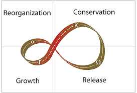
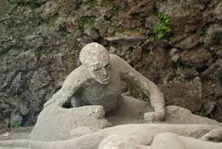
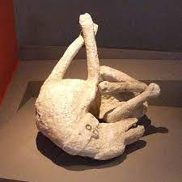

## We are not in Kansas anymore

The ecologists Buzz Holling and Lance Gundersen created the concept of the panarchy cycle to explain non-linear dynamics in living systems. Holling's original research told him that living systems are not abject to chaos, but actually seek out the edges of choas where they thrive. In those early days of ecological thinking, this came as a surprise. Previous notions of ecological health were based on metaphors of homeostasis and balance, not chaos and resilience. People today talk about the [search for a 5th attractor. ](https://medium.com/@memetic007/fifth-attractor-6d1a54fcda2e)Jim Rutt defines attractors in complexity science as "basins" in which different strategies can get caught in, and achieve a more stable (meta-stable is the best we should hope for) state. He argues that currently, both as a society and a planetary ecology, we operate in dangerous, unstable spaces, and the obvious attractor basins, such as AI-governed authoritarianism, or neo-liberal accelerationism, lead to extinction events. Rutt identifies 4 attractors that are unacceptable: neo-feudalism, neo-fascism, neo-dark ages, endogenous social collapse with environmental collapse. Hence, he is "in search for a 5th attractor."

Holling's panarachy, however, suggests that it is in the places that are far from equilibirum that we want to be, close to chaos are the places where we *should be*. There, at the edges of chaos, there is movement, a phase-like beat, rhythms of constant change through phase transitions, decompositions, and recompositions. The panarchy cylce was meant to illustrate this:

Hollings has recently called the Anthropocene "the Back Loop." The back loop of the panarcy cycle is the Ω (omega, release) phase of living systems, where relations are severed, and the energy stored in conserved systems is released. Hollings argued that the entire era of the Holocene, which began about 10,000 years ago with the retreat of the ice ages until now, was a prolonged period that favored "front loop dynamics," where new forms discover new niches (a- reorgnization) and begin to flourish there (r- growth), eventually developing bonds and relationships with each other such that the entire system complexifies into larger and larger systems that scale (K - conservation.) Everyone alive today is comfortable with thinking of reality in terms of front-loop, Holocene advantages. We like familiar systems that *grow*, *reproduce themselves over time, offer predictable pay-offs.*

> We are not in Kansas anymore.

<iframe width="100%" height="500" src="https://www.youtube.com/embed/uPnfuczOWb8" title="YouTube video player" frameborder="0" allow="accelerometer; autoplay; clipboard-write; encrypted-media; gyroscope; picture-in-picture; web-share" allowfullscreen></iframe>

Holling's point is that we are not in the Holocene anymore. And though we like to talk about resilience and resilience thinking, this is merely a way to fool ourselves into thinking that the Holocene might outlast its period. Because, you see, once people had the idea of the panarchy in their minds, they believed they could strategize themselves out of the back-loop phase. But that is not what the panarchy is meant to illustrate. The back loop is, *by definition*, a place where all strategies break down, and we should not be surprised to be surprised, because it is a phase of unprecedented events and novel occassions. I don't want to say much more about this, but please read (or re-read) [this post](https://open.substack.com/pub/bonnittaroy/p/time-change-and-causality-notes-toward-8e7?r=108vl&utm_campaign=post&utm_medium=web) before you continue on.

## What kind of culture do we need in back-loop realities?

Back-loop realities have been described by Nate Hargens as *[The Great Simplification](https://youtu.be/-xr9rIQxwj4?si=QHOt3WRfgwbQPqS7)*, and in his book *Wild Mind, Wild Earth*, David Hinton is implicitly addressing back-loop realities by exploring "Our Place in the Sixth Extinction." Hinton adopts a a Daoist view of reality wherein "death is a return home, a return to the generative tissue of Tao to ... the "nurturing mother," the "mother of all beneath heaven." When we cultivate a sense of belonging at this deeper level, as belonging to the unborn, undying "living existence- tissue" we never leave home. From this view,

> we are each a fleeting form conjured in Tao's generative process of perpetual transformation: not just born out of wild earth/Cosmos/Tao and returned to it in death ... but never out of it, totally unborn through and through, wild mind integral to wild earth.

We are in the midst of the earth's 6th mass extinction event. Through our grief over the vast destruction and suffering and death all around us, so close now that they are part of the ordinary everyday news cycle, this event reveals to us our deep love for this earth. We are saying farewell to the era of the Holocene which was our evolutionary womb for 10,000 years.

## Through the Holocene

Lyric Culture can be seen as a final station along our evolutionary journey through the Holocene. Here is where we must get off, since we are at the end of the line. We can journey on, but we need first to wander out into the landscape on foot and ask the land to speak to us. And we must listen, because the question of the land is recursive to the question of us. We walk the land and discover the needs of the residents there --- *this* particular paw-paw, *this* misunderstood witches broom, *this* struggling turtle, *this* lost songbird, *this* mushroom with no name, and *this* moss, hiding under a water wheel. We look. We partake in the sensing of what we need through them. This is the beginning of lyric culture. It is wordless particularliness. A respectful participation. Eventually we find, we discover, we land, as the residents lean into us, toward our wordlessness. Here they encounter this particular body, this particular silence, this particular need, this particular gesture toward mutual recognition.

It has become popular to label the different cultural epochs. There are a few different versions of this, but they all map fairly loosely together. Zoom out and we have the four-part cultural schema *pre-modern, modern, post-modern, *and now *meta-modern. *Gebser gives us the structures of consciousness *archaic, magical, mythic, mental, integral. *Merlin Donald maps the origins of the modern mind as *episodic, mimetic, oral, theoretic, digital.* McLuhan emphasizes the different stages of media technologies: speech, print, photograph, telephone, radio, movies, television, digital web ... and now, I suppose he would pencil in AI. If we ask the question: Where is meaning stored and shared? we can create a different map:

-   Soma - I touch

-   Mimetic - I gesture

-   Oral - I sing

-   Oral - I say

-   Narrative - I tell

-   Axial - I name

-   Lyric - I disclose

Each one of these is a kind of reflexivity. To touch means to self-other. We feel the other and we feel ourselves touching. We begin by *[feeling forward](https://www.aethos.studio/transmissions/feelingforward#open). *The worm crawling, the amoeba stretching, the flagellate flagellating, the neuron feeling foward to connect. The basis of life is touch.

<video controlslist="nodownload" src="https://www.dropbox.com/scl/fi/jkbf0savvvcqq36dllapj/feeling-forward.mp4?rlkey=oudvz4s2bgl2l3c1fwc9642vl&raw=1" controls=""></video>

Gesture is touch at a distance. I point to the stick, rather than touch it. I give you a hug sign because you are not near. I blow you a kiss because I am leaving, unless you come back this way

<video controlslist="nodownload" src="https://www.dropbox.com/scl/fi/u2ivttw2mskcic3luuko4/touch.mp4?rlkey=yskbr3fxgfqwzork3q2sfc1c7&raw=1" controls=""></video>

To sing means to gesture with sound. I sing my pleasure, I sing my anger, I sing my loneliness, I sing my wonder, I sing myself towards you ... I touch you with my song. You gesture with your dance. Culture begins here.

Unlike singing which is expansive and open, saying begins to be much more directional. I want to say *something* --- this thing, not that thing. Saying has a direction it's going in, it has something it is going for ... Singing surrounds us and takes flight. Saying points us to a destination. When the song is ended, the experience dissipates. We need to experience it again, and again. Saying is never-ending. It lands on a point, but it's the point that disappears. Even when it is not encoded in written form, saying persists even when it's done with its saying --- it lingesr there, awaiting response. *The words hang in the imbalance*.

Narrative forms of saying begin with story (tell) ing and swell to the great epics: Gilgamesh, Beowulf, Le Morte D'Arthur, The Illiad, The Odyssey. The epics go to great lengths to tell us more than what they say--- they withdraw the invitation to respond, but as a result, open themselves up to questions of interpretation. Unlike saying which is an invitation to *participate with*, telling creates *a thing* that can be *commented on*. Even before text was invented, meaning becomes more fixed--- more thing-like.

<iframe width="100%" height="500" src="https://www.youtube.com/embed/BV9t3Cp18Rc" title="YouTube video player" frameborder="0" allow="accelerometer; autoplay; clipboard-write; encrypted-media; gyroscope; picture-in-picture; web-share" allowfullscreen></iframe>

Cue the axial age "naming game", and we begin to think with thing-thoughts.

*for the difference between saying and naming, see

> [!info] [Saying without Naming](https://bonnittaroy.substack.com/p/saying-without-naming) 

---

Along with the axial age consciousness, most specifically with the Socratic philosophers, people started isolating the terms that pointed to things or properties of things (box, red) and relating to the terms as if they were themselves real things. These were called "Ideas" by Plato. In contrast to the particulars of the world, which were like shadows on the wall or a cave, the Ideas were more real, more clear and distinct. The Ideas represented the language of the gods --- how the gods stored and shared meaning. I am not going into all of this here, because the *Before Socrates* series last year was basically an exegesis about axial age minds. You can read the entire "Gadfly" series here (if you are a paid subscriber)

[The Gadfly: Before Socrates](https://bonnittaroy.substack.com/s/the-gadfly?utm_source=substack&utm_medium=menu)

## Lyric Culture

It is said by those who study such things, that Lyric Philosophy begins in wordlessness. There is a joke in here, similar to the Daoist joke that begins with "the Dao that can be spoken of is not the true Dao" --- which is the opening of one of the most profound *texts* of the ages. Jan Zwickey --- the major figure in Lyric Philosophy, is a big fan of Ludwig Wittgenstein, who, in writing the Tractatus Logico-Philosophicus, which is basically a collection of aphorisms, whose own statement of aim for the work was:

> What can be said at all can be said clearly; and whereof one cannot speak, thereof one must remain silent.

I think the problem here is not one of orality, or even of written text, but, as I [wrote in this post](https://open.substack.com/pub/bonnittaroy/p/saying-without-naming?r=108vl&utm_campaign=post&utm_medium=web) there are ways in which we *can say without naming.* It is this possibility that brings us to Lyric Culture which goes beyond what has been possible before. The aim of Lyric culture is not to remain speechless, or just to return to song and dance (although that is a part of it).

Lyric culture does not say, tell or name reality.\
It discloses reality.

In the first half of 2024, we will be exploring just this possibility --- of storing and sharing meaning through the disclosure of reality. Whereas saying, telling and naming *represent reality*, disclosure is a direct experience of *touching reality*. Disclosure removes all the intermediaries. It is raw, naked expression. Lyric vernacular is a direct mouthpiece for reality. By attending in such a way that reality reveals itself clearly, we are able to disclose that reality directly.

---

We find ourselves *here*, in the midst of the 6th great extinction event. *Here*, something that is revealing itself is wanting to be disclosed. *We*, among the sayers, tellers, namers--- the proclaimers and explainers --- suspect that something is wanting to be understood, not named or explained away.

> Something is wanting to *be seen perfectly*, *and so* *to be loved*.

## Extinction

This beginning of a new paragraph made its way into the previous post where it didn't belong. I pick up the story here:

[[In a recent episode with Nate Hagens](https://youtu.be/3l81C_11D7A?si=8WzNdbFs_E34dh0W), Peter Brannen used the surprising phrase "kill mechanisms intrinsic to the earth's natural systems." In his book, *The Ends of the World: Volcanic Apocalypses, Lethal Oceans, and Our Quest to Understand Earth's Past Mass Extinctions, *Brannen.... ]

I am reading about the ends (plural) of the world. Peter Brannen's book is about how the world ended not once, not twice, but 5 times before. And here we are, situated in another ending. The five ends:

450 MYA (Million Years Ago) End of the Ordovician: 86% of species lost\
425 MYA End of the Devonian : 75% of species lost\
250 MYA End of the Permian: 96% of species lost\
200 MYA End of the Triassic: 80% of species lost\
60 MYA End of Cretacous: 76% species lost

We are talking about periods so devastating that *almost nothing of our culture* *would survive the evolutionary record.* Only the rocks and the sediments, and a few fossils, would be left behind to tell a tale. Brennan begins with a quote from Henry Beetle Hough:

> [!quote] ​
> Something more than death has happened. ... We are looking upon the uttermost finality which can be written, glimpsing the darkness which will not know another ray of light. We are in touch with the reality of extinction.

and a story of walking along the banks of the Hudson with Paul Olsen, a paleontologist, looking at the New York City skyline and wondering aloud if anything of New York City would be preserved for for future geologists to discover:

> "You might hace a layer of stuff," he said dismissively, "but it's not a sedimentary basin, so eventually it would erode away to nothing. You'd have bits that would make it out into the ocean and would be buried and might show up--- some bottle caps, maybe. There would be some pretty heavy-duty isotopic signals. But the subway system wouldn't fossilize or anything. It all would erode away failry quickly."

Looking at my beer bottle cap on the floor of the tack room down in the barn, I saw it differently. Not a message *in the bottle*, I thought. A message *from the bottle*. Would some creature marvel at how the edges are flared and collect them as some already do now?

Vintage Bottle Caps for Sale on Ebay

Could they imagine our world from this flimsy evidence alone, or perhaps, someone might get lucky, like this man from Pompey, and "live" to tell more of our story:

Oh.. and the dog.

---

The salient point in the book is that the Earth is agentic. It has causal powers over everyone and every thing --- it creates and destroys. That phrase "kill mechanisms intrinsic to the earth's natural systems" --- eerily resonates within me. "

> [!quote] ​
> The forces of the earth are metamorphic.

How to face metamorphosis without falling into a crisis mentality, requires us to shift our view:

[Time, Change and Causality - Notes toward a metamorphosis of mind pt 7 - Metamorphosis & a Coda](https://bonnittaroy.substack.com/p/time-change-and-causality-notes-toward-02f)

---

Brennan completes the story by evoking the geologists' sense of *very* *deep time*:

> It is from this disorienting perspective that geologists operate to them, millions of years run together, seas divide continents, then drain away, and great mountain ranges erode to sand in moments. It's an outlook that's necessary to cultivate if one wants to get a handle on the staggering depths of geological time, which recedes behind us hundreds of millions of years and stretches out before us to infinity. If Olsen's attitude seems dispassionate in the extreme, it's a symptom of a lifetime's immersion in Earth's history, which is both vast beyond comprehension and, in some exceedingly rare moments, tragic beyond words.

When we enter deep time, we experience everything as fleeting, like soap bubbles. There is a short moment in time before the soap becomes a bubble, and there is a short moment when the soap is a bubble, and there is the next moment in time when the soap is no longer a bubble. My phrase for this experience is that the soap bubble is "there and not there at the same time." Lately, I've begun to see animals, people and mountains and rivers the same way: sensing how they are there and not there at the same time.

> [!quote] ​
> Here today,\
> Gone tomorrow\
> It's all a vanishing act.

Recently my horse, Gypsy Wings, died suddenly. She was perfectly normal at 2pm, and 9 hours later she was dead. Now I look at my other horses more perfectly, seeing that they too are here and not here at the same time. The eternal on-goingness of reality are experienced by us mortal beings as *passages*. Passages in time, passages through time. People of my age have traversed through three loops of the panarchy cycle. An individual traces out the very same phases in their lifetime that the epochal earth traverses in deep time. But now the entire world, the entire planet is encountering back-loop dynamics. And so, we are beginning to re-think reality. We are beginning to become Lyric.

## Becoming Lyric

Listening to music, we might ask "where is the meaning?" Is it in any particular note, or in the rhythm, or in the relations between notes, or is it somehow in the whole piece, or maybe its in the actualy *passing*, the *passage* that we experience? Lyric is attending to the *reality as passing through like music.* Each note is singular, every note and timing is irreducible, but the meaning is in the passing through of them. They pass through time, the music passes through us. "Lyric thought *means the way music does*, writes Jan Zwickey. "It is thought whose structure is resonant in which each aspect is turned by the whole."

Listen to these words as they pass. As text, they sit lifelessly on the screen. But...

> [!quote] ​
> as you pass the words through your mind, you give them life.

**Becoming Lyric- In the Shadows of the Axial Age**

In Vol 2 of this 3-vol cannon on Logological Investigations: *The Beginnings of European Theorizing: Reflexivity in the Archaic Age*, Barry Sandywell describes how the lyric form originated from a critical reflection against "the Homeric art of the roal bards and the dominant choral traditions of Archaic Greece." The Homeric, Sandywell will argue, carries within it the seeds of the Greek, *Socrative* culture and its logos-centered (logological) reflexivity which comes to dominate European thought and spreads over the globe. The grammar of logological reflexivity is what I[ previously ](https://bonnittaroy.substack.com/p/before-socrates-diaresis-dialectic)called thinking-with thoughts. Lyric culture has to come to terms with this, and cultivate a new vernacular. I wrote:

> "Coming to terms with" TWT (thinking with thoughts in our heads) means
>
> » Rejecting the notion that the structure of reality is something like the structure of TWT\
> » Rejecting the idea that truths can be summoned by TWT\
> » Rejecting the notion that contemplative praxis entails TWT\
> » Rejecting the notion that communicative praxis is fundamentally something like TWT\
> » Rejecting the idea that the self is fundamentally constituted by TWT
>
> It means coming to grips with the fact that
>
> *Reality is neither undiscoverable nor discoverable by the intellect alone, but by the whole embodied being, senses, feeling, intellect, and imagination. ~ Ian McGilchrist*
>
> and that thinking with thoughts in our heads,*strips reality of its concrete universalism, i.e. its sacredness,* by replacing it with vicious abstraction

> > Abstraction, functioning in this way, becomes a means for arrest far more than a means of advance in thought. It mutilates things; it creates difficulties and finds impossibilities; and more than half the trouble that metaphysicians and logicians give themselves over the paradoxes and dialectic puzzles of the universe may, I ma convinced, be traced to this relatively simple source. *The viciously privative employment of abstract characters and class names* is, I am persuaded, one of the great original sins of the rationalistic mind. ~ William James

> And while abstraction can help us see the structure of some truths in the same way that radiology can help us photograph the structure of the bones, using abstractions to get at 'the Ulimtate Truth' is like pulling the bones out of a body so that the skeleton can dance.

Sandywell writes: The lyric genre "creates the possibility of a non-Homeric conception of the nature of reality--- what we might call an ontology of the particular. He quotes from Theodore Adorno's *Dialectic of Enlightenment*:

> [!quote] ​
> The lyric work hopes to attain universality through unrestrained individuation.

"The celebration of the concrete particularity of experience," Sandywell writes, "suggests something like a different sensibility or 'world-view.' It is a world-view constructed of "sensuous images rooted in a recognizable world of everyday objects and experiences;" "displaying a resolutely personal response to the natural world--- an experience liberated from the limited patterns of earlier mythical symbols and the formular design of Homeric verse."

> With the discovery of the syntax of personal expression we see the emergence of the possibility of literary mutation: the legacy of poetic genres is not eternal; they can be modified and changed, under the impress of personal experience. Hesiod's ... [lyric] vision thus outlines a sense of nature that is still open for exploration and poetic naming. For lyric expression as a form of signification, truth lies in the detail and the particular. *Lyric is the act that names the salt of our tear, the texture of skin, the unconsolable pain of* *loss.* The simple discovery made by these poems is that the 'naming of the world' has not been exhausted by the work of mythos. *Other acts of signification, other genres of speech, are possible.*

Other points Sandywell makes about the origins and potential of lyric culture in-bewteen the archaic and Socratic ages:

- [Lyric culture] marks the appearance not only of a distinctive individual voice, but of the idea that the universe unfolds in a play of different 'perspectives'--- that the worlds of human experience are manifold in form and heterogenous in their modes of manifestation.
- The older generic constellations of myth and epic narrative are being eclipsed by the 'desiccating' light of new poetic principles and practices.
- The lyric voice rises like the Pheonix from the eclipsed body of the collective folk-tale and rigidly structured martial epic.
- Lyric's power lies in negating all ideologies, with the exception of the ideology of authentic selfhood.
- The choral lyric is an explicitly *collective* genre... the choral poet 'composed for others to sing, and these represented not an individual but a society.'
- The subject--- whether composer or reader --- does not use the lyric form for expressive purposes; rather **lyric form creates new kinds of subjectivity**.

In the following 50 pages, Sandywell surveys the different lyrical fragments and their poets through a century of Greek history, mostly pock-marked by strife and war. Lyric culture, Sandy concludes, was a "child of its time; which had all but disappeared by the time of the Persian Wars, with "the last and most powerful inheritor of the tradition of lyrical reflexivity ... [being] the Theban poet, Pindar (518-438 BC)."

Lyric reflexivity was an experiment which pushed back against the conceptual assault of the Homeric culture whose virtues were the mimetic replication of universal and eternal values. Against this assault, the lyric voice sang of an adventure in personalized self-reflexivity, which served as a radical intervention against the performative canons of early Greek culture.

Of course we cannot directly trace ourselves from there to here. In the modern era, I definitely see lyric culture in Rilke and Goethe, and today, in the transformative writings of Jan Zwickey, Barry Lopez, Christopher Alexander, and others. A lyrical vernacular has persisted through the ages. It is to these new voices that we will turn in subsequent posts.

## Ontological Design

The phrase "a time between worlds" has inspired many people. It is a lovely evocation of both the precarity and the preciousness of the world that is being left behind. We talk about "*a new world waiting to be born*." We ask *What wants to emerge? *These were good responses to the shocks we were experiencing. The shock of extinction, the realization that in order for the new forms to be born *the old forms have to be taken out of existence*.

When you fall through the ice into the freezing water, your body goes into a shock response and you cannot breathe. But it doesn't last forever. Knowing this, you know you need to pause for a few seconds until you start to breathe again; and then ... well, you can get on with swimming your way out.

This year I want to breathe again. This year I want to swim out from the icy depths to the verdant land. The panarchy cycle tells us that back-loop realities open up spaces for new life to enter where the old forms and connectivities have been taken out of existence. In *Designs for the Pluriverse: Radical Interdependence, Autonomy, and the Making of Worlds*, Arturo Escobar, describes *ontological* design as 1) examining primarily how design, through its very materiality, "hardwires" particular kinds of politics into bodies, spaces or objects" [here citing Rubio and Fogue] and 2) focusing on design's ability to broaden the range of possible ways of being through our bodies, spaces, and materialities. Escobar identifies the prevailing practices as *defuturing*, because they all lead to a singularity --- a kind of post-humans AI-led, techno-authoritarianism--- instead of opening the possibility space to many new possibilities. This practice he calls *the futuring of the pluriverse*.

The video of Eutopia that I posted in the first essay of this series, seems to me to represent a pluriversal view of the future. His argument goes as follows:

1.  The contemporary crisis is the result of deeply entrenched ways of being, knowing and doing. (What I call malware, and it runs very deep.)

2.  Ontological design involves a critical overturn of the dualist ontology of separation, control and appropriation. (Hence, putting the mind back into the body and the body back into nature and the material world.)

3.  We need to design for *transitions* (the great simplification), *cultural* *autonomy *(the protection of cultural and historical difference) and *place* (secure places for those cultures to thrive).

4.  Rediscovering people's abilities to shape their worlds through relational and collaborative tools and solutions.

"The book should be read along three axes" he writes:

> ontology, concerned with world making from the perspective of radical interdependence and a pluriversal imagination; design, as an ethical praxis of world making; and politics, centered on a reconceptualization of autonomy precisely as an expression of radical interdependence, not its negation.

The next three essays in this series will introduce three authors and their works, which I believe are foundational to ontological design, as well as prefiguring Lyric Culture:

Generating a Living World: Christopher Alexander

Pragmatic Imagination: Ann Pendleton-Julian & John Seely Brown

A Gnostic Revival: Mipham's Beacon of Certainty

## Lookup

- https://bonnittaroy.substack.com/p/lyric-culture-ontological-design
- https://bonnittaroy.substack.com/p/lyric-culture-ontological-design-c19
- https://bonnittaroy.substack.com/p/lyric-culture-ontological-design-8e1
