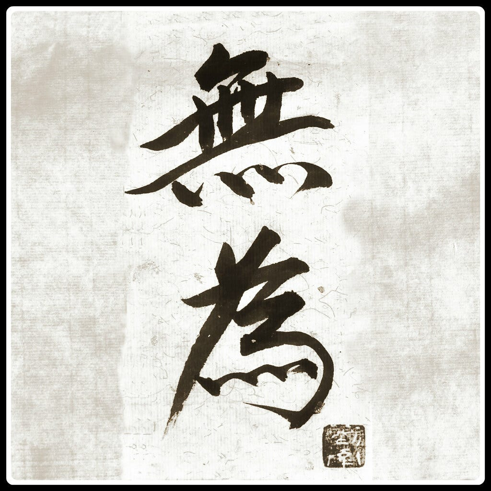

Whitehead protested that educational curricula were overladen with "inert ideas" that were both useless and harmful to students. (Hendley 1986).  Whitehead called for "relating ideas to that stream, compounded of sense perceptions, feelings, hopes, desires, and of mental activities adjusting thought to thought, which forms our life." The architect Christopher Alexander pointed to a faculty of evaluative judgment that people possess as deep intuitive feeling around "what is most alive, or alternately, what has more life." To which we can add "what gives more life?" A transformative attitude toward education would evaluate students' learning journeys along these questions, through aesthetically attuned intuitive sensibilities and collectively shared evaluative discourse. Evaluative discourse would orbit around a certain implicit quality we are aiming for, a quality too refined to be succinctly labelled or categorized – a *quality without a name* (Alexander 1979): *There is a central quality which is the root criterion of life and spirit in man... . The quality is objective and precise, but it cannot be named.* It cannot be named, but it can still function as an evaluative compass that unfolds meaning in individual contemplation and collective dialogue. Christopher Alexander folds and unfolds its meaning in a series of beautiful passages:

> *It is a subtle kind of freedom from inner contradictions\
> The word which we most often use to talk about this quality is 'alive'\
> But the very beauty of the word 'alive' is just its weakness\
> Another word we use to talk about the quality without a name is 'whole'\
> But the word 'whole' is too enclosed\
> Another facet of the quality which has no name is caught by the word 'comfortable'\
> But the word 'comfortable' is easy to misuse and has too many other meanings\
> A word which overcomes the lack of openness in the words 'whole' and 'comfortable'  is the word 'free'\
> And yet, of course, this freedom can be too theatrical: a pose, a form, a manner\
> A word which helps restore the balance is 'exact'*

At each step, there is a new potential meaning that is opened, yet Alexander also sees that naming both freezes in that particular meaning, and freezes out other potential meanings. At each step, Alexander composes a vignette that both captures the meaning as well as carries it forward and beyond: Speaking to the notion of 'exact' he writes:

> Suppose that I am trying to make a table for the blackbirds in my garden. In winter, when the snow is on the ground, and the blackbirds are short of food, I will put food out for them on the table. So I build the table; and dream about the clusters of blackbirds which will come flocking to the table in the snow. But it is not so easy to build a table that will really work. The birds follow their own laws; and if I don't understand them, they just won't come. If I put the table too low, the birds won't fly down to it. If it is too high in the air, or too exposed, the wind won't let them settle on it. If it is near a laundry line, blowing in the wind, they will be frightened by the moving line. Most of the places where I put the table actually don't work. I slowly learn that blackbirds have a million subtle forces guiding them in their behavior. If I don't understand these forces, there is simply nothing I can do to make the table come to life. So long as the placing of the table is inexact, my image of the blackbirds flocked around the table eating is just wishful thinking. To make the table live, I must take these forces seriously, and place the table in a position which is perfectly exact.

With simple, powerful words, Alexander captures what we might call *The Timeless Way of Teaching:*

> I slowly learn that children have a million subtle forces guiding their behavior. If I don't understand these forces, there is simply nothing I can do to make them learn. So long as I am not in the right relation with them, my goal of teaching is just wishful thinking. To help the students learn, I must take these forces seriously, and place myself in relation with them which is perfectly exact.

... and yet, of course, the word 'exact' doesn't  describe it properly...

Alexander goes on to talk about whole systems whose forces can be in conflict with each other, versus whole systems where the forces are aligned, or mutually generative of each other. The aligned system has more life, and more potential. The whole system is not trying to adapt to an external, hostile environment. It has an internal telos – to become more of what it is, to become more generative, to unfold more potential, to be more alive. The quality without a name functions as a guiding aethos – a combination of ethical and aesthetic value. To be ethical is to listen to and abide by the unfolding potential in ourselves and to listen to and speak to, the core potential in others – to serve and amplify life. The aesthetic aspect is in seeing that even objects in nature and the built environment, have potential to be more or less alive. Alexander writes

> There is a sense in which the distinction between something alive and something lifeless is much more general, and far more profound, than the distinction between living things and nonliving things, or between life and death. Things which are living may be lifeless; nonliving things may be alive. A man who is walking and talking can be alive; so are the waves at the ocean shore; so is a candle flame; a tiger may be more alive, because more in tune with its own inner forces than a man,

This is the kind of aethos that would ground an educational philosophy based on complex potential states. To educate would mean *to bring forth* by means of composing and recomposing "living wholes" whose forces are aligned so that there is more life. More life in our interactions. More life in our buildings, pathways, benches and gardens. More life in our ways of speaking and writing. More life in our civic engagements, communities and classrooms. More life in the objects we create, the products we manufacture and the food we grow and eat. Combining these metaphors, we can say that the imperative *educare* means *to bring forth more life. *This is a powerful message for both educators and students as people of the Anthropocene bearing witness to the current extinction events.

Language matters. Alexander's contemplation on the quality without a name, echoes the famous beginning lines of the Tao te Ching: *The Dao that can be named is not the real Dao.* A literal translation of "tao te ching" is "principles (ching) of the way (dao) of virtue (te)." The first principle being that the real always exceeds the naming of it. It is easy to see the paradoxical nature of this. The harder step is to *find the virtue* in the principle of not-naming. The power of naming is that it simultaneously discloses meaning while also leaving behind other potential meanings. In disclosing, it sets the potential of new meaning to carry forward. But it also sets the potential of retrieving that what has been left behind – un-named meaning potentials. Notice how language entails the same relational elements of complex potential states. This deep, implicit meaning – like the quality that Alexander is trying to say but "not-name" – is called "implicit understanding" by the philosopher Eugene Gendlin. According to Gendlin, we are aware of the implicit understanding through the felt-sense we have in our bodies. Gendlin dedicated his life to learning more about how the "felt-sense" inside our bodies both holds intuitive understanding, and how by "saying what we mean" we can carry it forward, in much the same way that Alexander carries forward the quality without a name. We have an implicit felt-sense of *the quality*. We know that by saying, we will capture just some – but not all (and perhaps not much) of what it *can say*. To say but not-name, means to keep open the passed-over possibilities through an artful use of language. This is the meaning in the opening sentence of the Tao te ching. The art of saying-without-naming is its *principle virtue.* To say without naming, is to carry forward meaning without freezing it up, or freezing out what has been left behind. What is left behind *still matters* – it doesn't merely exist there, waiting to be said. Rather, the felt-sense is an ongoing-active dimension of embodied participation, where what is not-said, and what is not-yet-said can be said to "subsist" in a field of dynamic potential.

## Further Resources

- [Original Content Material](https://bonnittaroy.substack.com/p/saying-without-naming)
